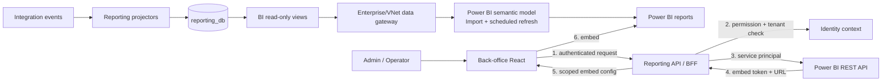

# 3.8 Power BI Analytics

## 1. Trạng thái hiện tại

**Kết luận khảo sát ngày 2026-09-19: dự án chưa tích hợp Power BI.**

Repository đã có nền móng Reporting nhưng chưa có artefact hoặc cấu hình Power BI chạy được.

| Đã có trong baseline | Chưa có |
|---|---|
| `Reporting Service`, `reporting_db` và ba projection Booking/Revenue/Occupancy | File báo cáo hoặc project Power BI (`.pbix`, `.pbit`, `.pbip`) |
| API `/api/v1/reports/revenue`, `/bookings`, `/occupancy` | Power BI semantic model, measure DAX và report pages |
| `dataAsOf`, timezone, metric definition và tenant scope trong contract | Power BI workspace/capacity, semantic model ID, report ID |
| RabbitMQ projector, Inbox/dedupe và checkpoint trong thiết kế | Microsoft Entra application/service principal và embed token flow |
| Một yêu cầu ngắn tại `note/1792006-001.md` | Gateway/refresh schedule, RLS, frontend embed và test evidence |

Tài liệu này là **thiết kế Proposed cho `FR-REPORT-004` (`SHOULD`) ở giai đoạn sau MVP theo SRS 2.1.0**. Power BI không thay thế Reporting API hoặc dashboard Back-office thuộc `FR-REPORT-001..002`. Muốn đưa Power BI vào MVP phải duyệt scope change vì baseline hiện tại chỉ cam kết các chức năng `MUST` và Slice 7 đã có dashboard riêng.

## 2. Mục tiêu và phạm vi

Power BI cung cấp lớp trực quan hóa đa chiều, chỉ đọc, trên dữ liệu Reporting đã được chuẩn hóa:

- Doanh thu gộp/ròng, hoàn tiền, phí nền tảng và khoản phải trả nhà xe theo thời gian, nhà xe và currency; phân tích theo tuyến chỉ dùng các metric có grain Booking/Trip phù hợp.
- Số Booking theo trạng thái, kênh thanh toán, tuyến và thời gian.
- Công suất ghế, số khách check-in và xu hướng khai thác theo chuyến/tuyến/nhà xe.
- Drill-down từ tổng quan đến grain được phép nhưng không lộ PII hành khách.
- Nhúng báo cáo trong Back-office Web; người dùng không phải có tài khoản Power BI riêng.
- Hiển thị rõ độ mới của projection và thời điểm semantic model được refresh.

Ngoài phạm vi:

- Không đọc trực tiếp `identity_db`, `transport_db`, `booking_db` hoặc `payment_db`.
- Không dùng Power BI để sửa Booking, Payment, Ticket hay dữ liệu nguồn.
- Không đưa email, số điện thoại, giấy tờ, QR token hoặc provider transaction ID vào semantic model.
- Không dùng **Publish to web** vì cơ chế này không đáp ứng authorization/tenant isolation của hệ thống.
- Không coi dashboard vận hành Grafana là Power BI; Grafana tiếp tục phục vụ telemetry, Power BI phục vụ business analytics.

## 3. Quyết định tích hợp đề xuất

### 3.1. Kiểu nhúng

Chọn **Power BI Embedded — embed for your customers (app owns data)**:

- Back-office xác thực người dùng bằng Identity Service hiện tại.
- Backend dùng Microsoft Entra service principal để gọi Power BI REST API.
- Backend tạo embed token ngắn hạn sau khi kiểm tra permission và tenant.
- React chỉ nhận `reportId`, `embedUrl`, embed token và expiry; không nhận client secret/certificate hoặc data-source credential.

Cách này phù hợp với người dùng Operator/Admin của nền tảng vì họ không cần đăng nhập Power BI. Microsoft mô tả flow app-owns-data và service principal tại [Embed a report for your customers](https://learn.microsoft.com/en-us/power-bi/developer/embedded/embed-customer-app) và [Embed with a service principal](https://learn.microsoft.com/en-us/power-bi/developer/embedded/embed-service-principal).

### 3.2. Chế độ dữ liệu

Baseline đề xuất là **Import mode** từ các view BI chỉ đọc trong `reporting_db`.

Lý do:

- Visual phản hồi ổn định và không đẩy từng thao tác filter/drill-down vào PostgreSQL production.
- Reporting projection đã eventual-consistent; business không yêu cầu Power BI realtime.
- Dễ kiểm soát grain, cột và PII trước khi dữ liệu rời PostgreSQL.
- App-owns-data với DirectQuery SSO hiện không phù hợp PostgreSQL; tài liệu Microsoft về [Generate an embed token](https://learn.microsoft.com/en-us/power-bi/developer/embedded/generate-embed-token) giới hạn SSO datasource của flow này cho Azure SQL Database.

Khi khối lượng dữ liệu tăng, bật incremental refresh sau khi xác nhận query folding và license/capacity. Không bật DirectQuery chỉ để che giấu một refresh pipeline chưa ổn định.

### 3.3. Ranh giới trách nhiệm

| Thành phần | Trách nhiệm |
|---|---|
| Reporting projectors | Consume event, dedupe, cập nhật projection và checkpoint |
| `reporting_db` | Read model có thể rebuild; nguồn duy nhất cho BI |
| BI views/read replica | Contract dữ liệu ổn định, chỉ expose cột được duyệt |
| Power BI semantic model | Star schema, relationships, DAX measures, RLS |
| Power BI report | Trang/visual/filter; không chứa business write action |
| Reporting API hoặc BFF backend | Authorize, ánh xạ report allowlist, tạo embed token, audit |
| Back-office React | Render report, loading/error/expired-token state và refresh token |

## 4. Kiến trúc logic



Nguyên tắc bắt buộc:

1. Power BI không nằm trên critical path Booking/Payment.
2. Power BI chỉ đọc projection, không join chéo database giao dịch.
3. `reporting_db` vẫn là read model nội bộ; Power BI semantic model chỉ là bản sao phân tích tại một thời điểm.
4. Nếu PostgreSQL ở private network, dùng enterprise on-premises data gateway hoặc VNet data gateway phù hợp hạ tầng; không public database để Power BI truy cập. Xem [On-premises data gateway](https://learn.microsoft.com/en-us/power-bi/connect-data/service-gateway-onprem).
5. Data-source credential thuộc gateway/Power BI connection, không nằm trong frontend hoặc Git.

Power BI/Power Query có connector PostgreSQL chính thức; xem [Power Query PostgreSQL connector](https://learn.microsoft.com/en-us/power-query/connectors/postgresql). Việc connector được hỗ trợ không thay thế network policy, gateway, least-privilege credential hoặc capacity test.

## 5. Data contract cho BI

Không cho Power BI phụ thuộc trực tiếp vào tên cột nội bộ của projection. Khi triển khai, tạo migration thuộc Reporting Service cho schema/view chỉ đọc sau:

| View đề xuất | Grain | Nguồn hiện có | Cột chính |
|---|---|---|---|
| `bi.vw_fact_revenue_daily` | một nhà xe/ngày/currency | `revenue_projections` | organization, date, currency, gross, refund, cancellation fee, commission, operator payable, net, counts, `data_as_of` |
| `bi.vw_fact_booking` | một Booking | `booking_projections` | booking ID dạng technical key, organization, trip, route, status, channel, seats, amounts, booked/paid/cancelled timestamps, `data_as_of` |
| `bi.vw_fact_trip_occupancy` | một Trip | `occupancy_projections` | organization, route, trip, departure, status, capacity, available, held, booked, checked-in, `data_as_of` |
| `bi.vw_projection_freshness` | một projection | `projection_checkpoints` | projection name, status, last occurred/processed time, lag seconds |

Role PostgreSQL `powerbi_reader`:

- chỉ có `CONNECT`, `USAGE` trên schema BI và `SELECT` trên các BI view;
- không có quyền trên schema/table giao dịch khác;
- không có `INSERT`, `UPDATE`, `DELETE`, `TRUNCATE` hoặc DDL;
- credential tách theo environment và rotate được;
- ưu tiên read replica nếu refresh gây contention lên primary.

Mọi thay đổi cột hoặc grain của BI view phải được review như data contract. Thêm cột theo kiểu expand-and-contract; không rename/drop trước khi semantic model mới đã deploy.

## 6. Semantic model đa chiều

Mô hình Power BI dùng star schema; dimension dùng để filter/group và fact dùng để tổng hợp. Đây cũng là hướng dẫn chính thức của Microsoft tại [Understand star schema for Power BI](https://learn.microsoft.com/en-us/power-bi/guidance/star-schema).

```text
DimDate ───────────────┬── FactRevenueDaily
DimOrganization ───────┼── FactBooking
DimRoute ──────────────┼── FactTripOccupancy
DimCurrency ───────────┤
DimPaymentChannel ─────┤
DimBookingStatus ──────┤
DimTripStatus ─────────┘
```

### 6.1. Grain và quan hệ

- Mỗi fact giữ một grain duy nhất như bảng ở mục 5.
- Quan hệ mặc định `1:*`, filter một chiều từ dimension sang fact.
- Không tạo many-to-many nếu chưa có bridge table và test chống double count.
- `DimDate` là bảng ngày chuẩn; dùng quan hệ active theo `period_date`, `booked_at` hoặc `departure_at` tùy fact.
- Dimension chỉ filter fact có quan hệ hợp lệ. Ví dụ `DimRoute` không filter `FactRevenueDaily` vì projection doanh thu hiện có grain nhà xe/ngày/currency; không tạo quan hệ giả hoặc phân bổ doanh thu theo tuyến khi chưa có contract nguồn.
- UUID chỉ dùng làm technical key/drill-through; không hiển thị mặc định trên visual.
- Currency luôn là dimension/filter bắt buộc. Không cộng nhiều currency vào cùng một giá trị nếu chưa có tỷ giá và policy quy đổi được phê duyệt.
- Timestamp nguồn lưu UTC; label và date slicing mặc định theo `Asia/Ho_Chi_Minh`, đồng bộ với API report.

### 6.2. Measure chuẩn

| Measure | Định nghĩa |
|---|---|
| Gross Revenue | `SUM(FactRevenueDaily[GrossRevenue])` |
| Refund Amount | `SUM(FactRevenueDaily[RefundAmount])` |
| Net Revenue | `Gross Revenue - Refund Amount`; phải khớp `net_revenue` nguồn |
| Platform Commission | `SUM(FactRevenueDaily[PlatformCommission])` |
| Operator Payable | `SUM(FactRevenueDaily[OperatorPayable])` |
| Booking Count | `DISTINCTCOUNT(FactBooking[BookingId])` |
| Cancelled Booking Count | Booking có status `CANCELLED` hoặc `REFUNDED` theo metric definition đã duyệt |
| Cancellation Rate | `Cancelled Booking Count / Booking Count`, trả blank khi mẫu số bằng 0 |
| Seats Booked | `SUM(FactTripOccupancy[BookedCount])` |
| Occupancy Rate | `Seats Booked / SUM(Capacity)`, trả blank khi capacity bằng 0 |
| Check-in Rate | `SUM(CheckedInCount) / Seats Booked`, trả blank khi số ghế đã đặt bằng 0 |

Quy tắc tiền:

- Số tiền VND vẫn dùng integer từ nguồn, không dùng floating point.
- Phí nền tảng và khoản phải trả nhà xe chỉ ghi nhận theo settlement `PREPAID` đã thu; `PAY_LATER` vẫn xuất hiện trong thống kê Booking nhưng không được cộng như doanh thu đã thu qua nền tảng.
- Measure phải đối chiếu được với Reporting API trên cùng filter, timezone và `dataAsOf`.

### 6.3. Trang báo cáo tối thiểu

| Trang | Visual chính | Filter bắt buộc |
|---|---|---|
| Executive Overview | KPI revenue/booking/occupancy, trend theo ngày, top route | thời gian, organization, currency |
| Revenue & Refund | gross/net/refund/commission/operator payable, waterfall/trend | thời gian, organization, currency |
| Booking Analysis | booking theo status/channel/route, cancellation rate | thời gian, organization, status, channel |
| Occupancy & Check-in | occupancy/check-in theo route/trip/departure | thời gian, organization, route, trip status |
| Data Freshness | projection status, lag, source/model refresh time | projection/environment |

Mỗi trang nghiệp vụ hiển thị:

- timezone đang dùng;
- định nghĩa metric hoặc tooltip dẫn tới định nghĩa;
- `Source data as of` từ projection checkpoint;
- `Semantic model refreshed at` của lần Import gần nhất;
- cảnh báo khi projection `DEGRADED/REBUILDING` hoặc vượt ngưỡng lag.

Các trang có permission khác nhau phải được đóng gói thành report artifact riêng dùng chung semantic model: `Overview`, `Revenue`, `Booking` và `Occupancy`. Ẩn page hoặc slicer không phải authorization. `Overview` chỉ được embed khi actor có đủ ba permission; mỗi report còn lại chỉ chứa nhóm metric mà permission tương ứng cho phép.

## 7. Tenant isolation và authorization

### 7.1. Dynamic RLS

Một semantic model dùng hai role rõ ràng:

- `TenantViewer`: filter `DimOrganization[OrganizationId]` bằng organization ID do backend đưa vào effective identity/custom data của embed token.
- `PlatformViewer`: không filter organization, chỉ cấp cho platform Admin có permission tương ứng.

Biểu thức role tenant dự kiến:

```dax
DimOrganization[OrganizationId] = CUSTOMDATA()
```

Backend truyền đúng một UUID organization làm `customData`, actor ID ổn định làm effective username, semantic model ID và duy nhất role `TenantViewer`. Với platform Admin, backend truyền duy nhất role `PlatformViewer`. Hai role loại trừ nhau; không bao giờ cấp đồng thời vì nhiều RLS role có thể hợp nhất quyền ngoài ý muốn.

Backend không nhận `organizationId`, `workspaceId`, `reportId`, role hoặc username tùy ý từ frontend để đưa vào token. Các giá trị này phải được suy ra từ access token/context và allowlist cấu hình server.

Report filter/slicer không phải security boundary. RLS phải nằm trong semantic model; backend permission check và RLS là hai lớp độc lập. Với service principal và model có RLS, effective identity là bắt buộc. Xem [Generate an embed token](https://learn.microsoft.com/en-us/power-bi/developer/embedded/generate-embed-token) và [Security in Power BI Embedded](https://learn.microsoft.com/en-us/power-bi/developer/embedded/embedded-row-level-security).

Nếu số tenant, yêu cầu compliance hoặc blast radius tăng, đánh giá chuyển sang workspace/semantic model riêng theo tenant bằng service principal profiles. MVP mở rộng ban đầu dùng một workspace theo environment và dynamic RLS để giảm chi phí vận hành, nhưng phải có test cross-tenant bắt buộc.

### 7.2. Permission mapping

| Báo cáo/trang | Permission nội bộ tối thiểu |
|---|---|
| Revenue & Refund | `report.revenue.read` |
| Booking Analysis | `report.booking.read` |
| Occupancy & Check-in | `report.occupancy.read` |
| Overview chứa cả ba nhóm | cả ba permission trên |
| Data Freshness | ít nhất một report permission; chỉ hiển thị projection liên quan |

Không cấp `allowEdit`, `SaveAs` hoặc quyền authoring cho người xem Back-office.

## 8. Embed API đề xuất

Endpoint này là **thiết kế hậu MVP**, chưa được thêm vào OpenAPI/runtime:

```http
POST /api/v1/analytics/power-bi/embed-config
Authorization: Bearer <platform access token>
Content-Type: application/json

{
  "reportKey": "overview"
}
```

Backend thực hiện theo thứ tự:

1. Xác thực access token và account/session state theo baseline Identity.
2. Resolve `reportKey` qua allowlist server thành workspace/report/semantic-model ID.
3. Kiểm tra permission và lấy tenant từ trusted identity context.
4. Chọn `TenantViewer` hoặc `PlatformViewer`; luôn truyền effective identity cho model dùng RLS.
5. Lấy/cached Microsoft Entra token server-side, gọi Generate Token API với quyền `View`.
6. Trả embed config ngắn hạn và audit actor, tenant, report key, correlation ID; không log token.

Response mẫu:

```json
{
  "reportId": "00000000-0000-0000-0000-000000000000",
  "embedUrl": "https://app.powerbi.com/reportEmbed?...",
  "embedToken": "<short-lived-bearer-token>",
  "expiresAt": "2026-09-19T10:30:00Z",
  "sourceDataAsOf": "2026-09-19T09:58:00Z",
  "timezone": "Asia/Ho_Chi_Minh"
}
```

Response dùng `Cache-Control: no-store`. Frontend renew token trước expiry, dừng hiển thị report khi renew thất bại và không persist embed token vào local/session storage.

## 9. Cấu hình và secret

Các key dưới đây chỉ được thêm khi feature được triển khai:

| Key | Loại | Quy tắc |
|---|---|---|
| `Features:PowerBI` | config | mặc định `false`; route/menu/embed endpoint không active khi tắt |
| `PowerBI:TenantId` | config | Microsoft Entra tenant theo environment |
| `PowerBI:ClientId` | config | app registration/service principal ID |
| `PowerBI:WorkspaceId` | config | workspace riêng cho dev/staging/prod |
| `PowerBI:Reports:Overview:ReportId` | config | server-side allowlist, không nhận ID tự do từ client |
| `PowerBI:SemanticModelId` | config | semantic model của environment |
| `PowerBI:AuthenticationMode` | config | `Certificate` ở shared/prod; secret chỉ cho local nếu cần |
| `PowerBI:ClientCertificate` hoặc `PowerBI:ClientSecret` | **secret** | secret store/environment injection; không commit/log |
| `PowerBI:EmbedTokenMinutes` | config | không vượt lifetime được Power BI/Entra cấp |
| `PowerBI:RefreshLagWarningMinutes` | config | ngưỡng hiển thị cảnh báo freshness |

Workspace, gateway connection và credential tách biệt giữa môi trường. Không dùng `My Workspace`; service principal chỉ được thêm vào workspace cần thiết và tenant settings chỉ enable cho security group riêng.

## 10. Refresh, vận hành và failure mode

### 10.1. Chính sách refresh

- Bản demo đầu tiên: full Import refresh thủ công hoặc theo lịch sau khi projector ổn định.
- Production-like: lịch refresh phải được chốt theo license/capacity và SLO; không hứa realtime.
- Khi dữ liệu đủ lớn, cấu hình `RangeStart`/`RangeEnd` và incremental refresh cho fact có cột thời gian phù hợp. Xem [Configure incremental refresh](https://learn.microsoft.com/en-us/power-bi/connect-data/incremental-refresh-configure).
- Refresh chỉ chạy sau migration tương thích và không cạnh tranh tài nguyên với workload giao dịch; ưu tiên read replica hoặc khung giờ thấp tải.
- So sánh refresh history với `projection_checkpoints`; một refresh “Succeeded” không có nghĩa projection nguồn đã bắt kịp event.

### 10.2. Failure mode

| Tình huống | Hành vi |
|---|---|
| Projection lag/rebuild | Report vẫn mở nhưng hiện freshness warning; không trình bày là realtime |
| Semantic model refresh lỗi | Giữ bản dữ liệu gần nhất, cảnh báo và alert owner; không ảnh hưởng Booking/Payment |
| Gateway/PostgreSQL mất kết nối | Refresh retry có giới hạn; không mở public DB hoặc nới firewall tùy tiện |
| Power BI API unavailable | Embed endpoint trả lỗi dependency an toàn; Back-office hiện retry/fallback link tới report API dashboard |
| Embed token hết hạn | Frontend xin token mới; không yêu cầu user đăng nhập Power BI |
| RLS/effective identity thiếu | Fail closed; không tạo token “toàn bộ dữ liệu” làm fallback |
| Schema BI view thay đổi | CI/refresh staging phải fail trước production; triển khai expand-and-contract |

Telemetry tối thiểu: embed-token latency/error (không log token), refresh status/duration, gateway availability, projection lag, report load/error event, actor/tenant/report audit.

## 11. Artefact và source control

Khi bắt đầu triển khai, tạo cấu trúc sau:

```text
workspace/
└── analytics/
    └── power-bi/
        ├── README.md
        ├── BusTicketAnalytics.pbip
        ├── BusTicketAnalyticsOverview.Report/
        ├── BusTicketAnalyticsRevenue.Report/
        ├── BusTicketAnalyticsBooking.Report/
        ├── BusTicketAnalyticsOccupancy.Report/
        └── BusTicketAnalytics.SemanticModel/
```

Ưu tiên Power BI Project (`.pbip`) để report/semantic model ở dạng text có thể review trong Git; `.pbix` chỉ là release/export artefact, không phải nguồn duy nhất. Tại thời điểm viết tài liệu, PBIP vẫn được Microsoft ghi là Preview, nên nhóm phải pin Power BI Desktop version và xác nhận giới hạn trước khi dùng làm delivery baseline: [Power BI Desktop projects](https://learn.microsoft.com/en-us/power-bi/developer/projects/projects-overview).

Thêm vào `.gitignore` khi có PBIP:

```gitignore
**/.pbi/localSettings.json
**/.pbi/cache.abf
```

Không commit credential, access/embed token, local connection string hoặc cache dữ liệu. Repository hiện nằm trong thư mục đồng bộ OneDrive; Microsoft cảnh báo PBIP trong thư mục OneDrive/SharePoint đồng bộ có thể gặp lỗi sync. Khi author report, ưu tiên clone local ngoài thư mục sync rồi commit/push Git, hoặc ít nhất tạm dừng sync và kiểm tra diff trước khi publish.

## 12. Kế hoạch triển khai

| Giai đoạn | Deliverable | Exit criteria |
|---|---|---|
| 0. Scope/licensing gate | ADR chấp nhận, owner, capacity/license, data residency và budget | Không còn quyết định làm thay đổi topology hoặc chi phí |
| 1. Data contract | BI views, read-only role, synthetic seed, data dictionary | SQL contract test và PII review pass |
| 2. Semantic model | Star schema, measures, timezone/currency rules, RLS | Measure reconciliation và cross-tenant tests pass |
| 3. Report | Năm trang tối thiểu, tooltip/freshness/accessibility | Product/Finance review pass |
| 4. Embed backend | Service principal, allowlist, embed endpoint, audit | Permission, expiry, fail-closed và secret scan pass |
| 5. Back-office | React embed, loading/error/renew/fallback state | E2E Admin/Operator pass |
| 6. Refresh/operations | Gateway, schedule, alert, runbook, rollback | Staging refresh và dependency-failure drill pass |

## 13. Acceptance checklist

- [ ] Không có Power BI query nào vào database ngoài `reporting_db`/read replica được duyệt.
- [ ] `powerbi_reader` không có quyền ghi và chỉ đọc BI views.
- [ ] Operator tenant A không xem được bất kỳ row/aggregate/drill-through nào của tenant B.
- [ ] Platform Admin chỉ xem toàn nền tảng khi có đúng permission và role `PlatformViewer`.
- [ ] Thiếu/sai effective identity làm request thất bại, không bỏ RLS.
- [ ] Revenue, refund, commission, booking và occupancy khớp Reporting API/SQL fixture trên cùng filter.
- [ ] `PAY_LATER` không bị tính thành tiền nền tảng đã thu.
- [ ] Currency và timezone luôn hiển thị; không cộng chéo currency.
- [ ] Report hiển thị cả source freshness và semantic-model refresh time.
- [ ] Không có PII/secret/token trong model, visual, export, log hoặc Git.
- [ ] Embed token không persist, không cache và được renew trước expiry.
- [ ] Power BI/gateway/refresh lỗi không ảnh hưởng luồng Booking/Payment.
- [ ] Có owner, alert, runbook, rollback và evidence refresh/RLS trước production.

## 14. Các quyết định còn phải chốt

1. Power BI license/capacity và ngân sách cho dev/staging/production.
2. Data residency và tenant Microsoft Entra/Power BI sử dụng.
3. Enterprise gateway hay VNet data gateway theo nơi đặt PostgreSQL.
4. SLO freshness thực tế và lịch refresh tương ứng.
5. Một semantic model dùng dynamic RLS hay workspace isolation theo tenant khi scale.
6. PBIP Preview có được chấp nhận làm source-control baseline hay tạm quản lý `.pbix` kèm release checksum.

Chưa chốt sáu mục này thì tài liệu vẫn ở trạng thái `Proposed`; không đưa ID/secret giả vào `appsettings.json` và không tuyên bố Power BI đã được tích hợp.
