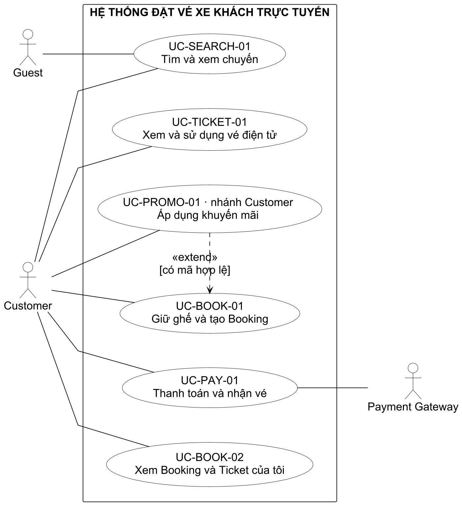

# 4. Đặc tả Use Case và sơ đồ

[← Chương 3](../03-quy-trinh-va-quy-tac-nghiep-vu.md) · [Mục lục](../README.md) · [Chương 5 →](../05-yeu-cau-chuc-nang.md)

## 4.1. Mục đích

Chương này mô tả cách actor tương tác với hệ thống để đạt mục tiêu nghiệp vụ. Use Case tập trung vào hành vi quan sát được, tiền/hậu điều kiện, luồng chính, nhánh thay thế và ngoại lệ. Chi tiết HTTP, database và thuật toán không được dùng thay cho mô tả nghiệp vụ.

## 4.2. Bảng tổng hợp Use Case

Bảng dưới đây cung cấp cái nhìn tổng quan về toàn bộ Use Case trước khi đi vào đặc tả chi tiết. Mức `MUST` là phạm vi bắt buộc của sản phẩm; mức `SHOULD` có thể được lùi theo quyết định phạm vi đã được ghi nhận.

| STT | Mã Use Case | Tên Use Case | Actor chính | Mức ưu tiên |
|---:|---|---|---|:---:|
| 1 | `UC-AUTH-01` | Đăng ký và kích hoạt tài khoản | Guest | MUST |
| 2 | `UC-AUTH-02` | Đăng nhập | Customer, Driver, Operator Staff, Admin | MUST |
| 3 | `UC-AUTH-03` | Refresh phiên và đăng xuất | User đã đăng nhập | MUST |
| 4 | `UC-AUTH-04` | Quên và đặt lại mật khẩu | Guest/User | MUST |
| 5 | `UC-PROFILE-01` | Xem và cập nhật hồ sơ | Customer | MUST |
| 6 | `UC-SEARCH-01` | Tìm và xem chuyến | Guest, Customer | MUST |
| 7 | `UC-BOOK-01` | Giữ ghế và tạo Booking | Customer | MUST |
| 8 | `UC-BOOK-02` | Xem Booking và Ticket của tôi | Customer | MUST |
| 9 | `UC-TICKET-01` | Xem và sử dụng vé điện tử | Customer | MUST |
| 10 | `UC-PAY-01` | Thanh toán và nhận vé | Customer | MUST |
| 11 | `UC-CANCEL-01` | Hủy vé và hoàn tiền | Customer | MUST |
| 12 | `UC-CHANGE-01` | Đổi vé | Customer | SHOULD |
| 13 | `UC-OPS-01` | Quản lý thông tin nhà xe | Operator Staff có quyền quản lý Organization | MUST |
| 14 | `UC-OPS-02` | Quản lý xe và sơ đồ ghế | Operator Fleet Manager | MUST |
| 15 | `UC-OPS-03` | Quản lý tài xế | Operator Staff có quyền nhân sự/vận hành | MUST |
| 16 | `UC-OPS-04` | Quản lý tuyến và điểm dừng | Operator Scheduler | MUST |
| 17 | `UC-OPS-05` | Tạo và mở bán chuyến xe | Operator Scheduler | MUST |
| 18 | `UC-OPS-06` | Vận hành Trip và danh sách hành khách | Operator Operations, Driver | MUST |
| 19 | `UC-DRIVER-01` | Check-in hành khách | Driver, Operator Operations | MUST |
| 20 | `UC-TRIP-01` | Hủy chuyến xe có vé đã bán | Operator Operations, Admin | MUST |
| 21 | `UC-PROMO-01` | Quản lý và áp dụng Promotion | Operator Staff/Admin khi quản lý; Customer khi áp dụng | SHOULD |
| 22 | `UC-REVIEW-01` | Tạo và cập nhật Review | Customer | SHOULD |
| 23 | `UC-REVIEW-02` | Kiểm duyệt Review | Admin, Operator Staff có permission | SHOULD |
| 24 | `UC-NOTIF-01` | Xem và cấu hình Notification | User | MUST |
| 25 | `UC-ADMIN-01` | Quản lý User, Organization và quyền | Admin | MUST |
| 26 | `UC-ADMIN-02` | Tra cứu giao dịch và audit | Admin, Operator Finance theo phạm vi | MUST |
| 27 | `UC-ADMIN-03` | Quản lý khiếu nại | Admin hoặc nhân sự hỗ trợ được cấp quyền | SHOULD |
| 28 | `UC-REPORT-01` | Xem và xuất báo cáo | Admin, Operator Finance | MUST |

Tổng cộng có 28 Use Case, gồm 23 Use Case mức `MUST` và 5 Use Case mức `SHOULD`.

## 4.3. Sơ đồ Use Case tổng quát

[Bộ Use Case Diagram Mermaid trong Markdown](../../system-design/02-02-use-case-diagrams/README.md) bao phủ đủ 28 mã `UC-*`, actor, system boundary và quan hệ `«include»/«extend»` chính.

### 4.3.1. Tìm chuyến và đặt vé

*Hình 4.1 — Sơ đồ Use Case tìm chuyến và đặt vé.*

Sơ đồ được dựng từ [mã nguồn PlantUML](../../diagrams/subdiagrams/use-cases/use-cases-booking.puml). `Payment Gateway` là actor hỗ trợ nằm ngoài biên hệ thống. Quan hệ `«extend»` đi từ **Áp dụng khuyến mãi** đến **Giữ ghế và tạo Booking** vì đây là hành vi tùy chọn, chỉ xảy ra khi Customer cung cấp mã hợp lệ.

- [Use Case Operator Staff và Driver](../../diagrams/subdiagrams/use-cases/use-cases-operations.html)
- [Use Case Admin](../../diagrams/subdiagrams/use-cases/use-cases-admin.html)

Các sơ đồ trên thể hiện phạm vi và quan hệ giữa actor với các nhóm chức năng. Bảng tổng hợp và nội dung đặc tả bên dưới là nguồn xác định đầy đủ hành vi của từng Use Case.

## 4.4. Phân nhóm đặc tả Use Case chi tiết

| Mục | Nhóm Use Case | Tài liệu | Phạm vi Use Case |
|---|---|---|---|
| 4.4.1 | Định danh và hồ sơ | [Xem đặc tả](./01-identity-and-profile.md) | `UC-AUTH-01..04`, `UC-PROFILE-01` |
| 4.4.2 | Tìm chuyến, Booking và Ticket | [Xem đặc tả](./02-search-booking-ticket.md) | `UC-SEARCH-01`, `UC-BOOK-01..02`, `UC-TICKET-01` |
| 4.4.3 | Payment, hủy và đổi vé | [Xem đặc tả](./03-payment-cancellation-change.md) | `UC-PAY-01`, `UC-CANCEL-01`, `UC-CHANGE-01` |
| 4.4.4 | Vận hành nhà xe và Trip | [Xem đặc tả](./04-operator-trip-checkin.md) | `UC-OPS-01..06`, `UC-DRIVER-01`, `UC-TRIP-01` |
| 4.4.5 | Promotion, Review và Notification | [Xem đặc tả](./05-promotion-review-notification.md) | `UC-PROMO-01`, `UC-REVIEW-01..02`, `UC-NOTIF-01` |
| 4.4.6 | Quản trị và báo cáo | [Xem đặc tả](./06-administration-reporting.md) | `UC-ADMIN-01..03`, `UC-REPORT-01` |

Mỗi Use Case chi tiết phải có mục tiêu, actor, kích hoạt khi phù hợp, tiền điều kiện, hậu điều kiện, luồng chính, luồng thay thế/ngoại lệ và liên kết tới FR/BR/AC liên quan.

## 4.5. Danh mục Activity Diagram

Bộ Activity Diagram Mermaid đầy đủ cho `BP-01..07` nằm tại [System Design — Activity Diagrams](../../system-design/02-04-activity-diagrams/README.md).

| Quy trình | Sơ đồ | Trạng thái |
|---|---|---|
| BP-01 — Tìm chuyến và đặt vé | [Activity BP-01](../../system-design/02-04-activity-diagrams/01-search-booking-payment.md) | Hiện có — Mermaid/Markdown |
| BP-02 — Hủy vé và hoàn tiền | [Activity BP-02](../../system-design/02-04-activity-diagrams/02-ticket-cancellation-refund.md) | Hiện có — Mermaid/Markdown |
| BP-03 — Đổi vé | [Activity BP-03](../../system-design/02-04-activity-diagrams/03-ticket-change.md) | Hiện có — Mermaid/Markdown |
| BP-04 — Tạo và mở bán chuyến xe | [Activity BP-04](../../system-design/02-04-activity-diagrams/04-create-publish-trip.md) | Hiện có — Mermaid/Markdown |
| BP-05 — Thực hiện chuyến và check-in | [Activity BP-05](../../system-design/02-04-activity-diagrams/05-trip-operation-checkin.md) | Hiện có — Mermaid/Markdown |
| BP-06 — Hủy chuyến xe | [Activity BP-06](../../system-design/02-04-activity-diagrams/06-trip-cancellation.md) | Hiện có — Mermaid/Markdown |
| BP-07 — Quản lý tài khoản, nhà xe và nền tảng | [Activity BP-07](../../system-design/02-04-activity-diagrams/07-account-platform-management.md) | Hiện có — tách nhánh theo mục tiêu actor |

## 4.6. Danh mục Sequence Diagram

Toàn bộ 28 Use Case có phiên bản sequence Mermaid nhúng trực tiếp trong Markdown tại [System Design — Sequence Diagrams](../../system-design/02-03-sequence-diagrams/README.md).

| Mục đích | Sơ đồ |
|---|---|
| Giữ ghế | [Sequence SeatHold](../../diagrams/subdiagrams/sequences/sequence-seat-hold.html) |
| Tạo Booking | [Sequence Create Booking](../../diagrams/subdiagrams/sequences/sequence-create-booking.html) |
| Thanh toán với provider | [Sequence Payment Provider](../../diagrams/subdiagrams/sequences/sequence-payment-provider.html) |
| Xác nhận Payment và Booking | [Sequence Payment Confirm Booking](../../diagrams/subdiagrams/sequences/sequence-payment-confirm-booking.html) |
| Phát hành Ticket | [Sequence Ticket Delivery](../../diagrams/subdiagrams/sequences/sequence-ticket-delivery.html) |
| Preview hủy | [Sequence Cancellation Preview](../../diagrams/subdiagrams/sequences/sequence-cancel-preview.html) |
| Refund | [Sequence Refund Saga](../../diagrams/subdiagrams/sequences/sequence-refund-saga.html) |
| Publish Trip | [Sequence Publish Trip](../../diagrams/subdiagrams/sequences/sequence-publish-trip.html) |
| Hủy Trip | [Sequence Cancel Trip](../../diagrams/subdiagrams/sequences/sequence-cancel-trip.html) |

## 4.7. Danh mục State Diagram

Bộ State Machine Mermaid bám trực tiếp các transition tại Chương 6 nằm tại [System Design — State Machine Diagrams](../../system-design/02-05-state-machine-diagrams/README.md).

- [TripSeat](../../system-design/02-05-state-machine-diagrams/01-trip-seat.md)
- [SeatHold](../../system-design/02-05-state-machine-diagrams/02-seat-hold.md)
- [Booking](../../system-design/02-05-state-machine-diagrams/03-booking.md)
- [Payment](../../system-design/02-05-state-machine-diagrams/04-payment.md)
- [Ticket](../../system-design/02-05-state-machine-diagrams/05-ticket.md)
- [Refund](../../system-design/02-05-state-machine-diagrams/06-refund.md)
- [Trip](../../system-design/02-05-state-machine-diagrams/07-trip.md)

Các trạng thái và chuyển trạng thái có hiệu lực được định nghĩa trong [Chương 6](../06-yeu-cau-trang-thai.md).

[← Chương 3](../03-quy-trinh-va-quy-tac-nghiep-vu.md) · [Mục lục](../README.md) · [Chương 5 →](../05-yeu-cau-chuc-nang.md)
