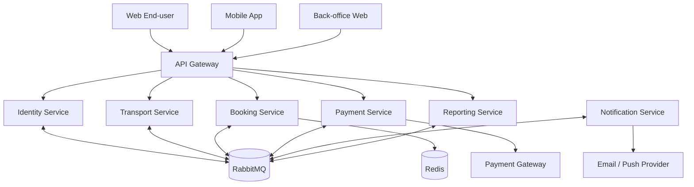

# Ràng buộc kiến trúc dịch vụ

## 1. Mục tiêu kiến trúc

Kiến trúc phải chứng minh các đặc tính hướng dịch vụ: ranh giới nghiệp vụ rõ, hợp đồng API/event rõ, triển khai độc lập, quyền sở hữu dữ liệu độc lập và giao tiếp lỏng giữa các service.

## 2. Sơ đồ container/service



## 3. Danh mục service

| Service | Trách nhiệm | Dữ liệu sở hữu |
|---|---|---|
| API Gateway | Routing, TLS termination, CORS, rate limit, correlation ID | Không sở hữu dữ liệu nghiệp vụ |
| Identity Service | User, credential, role, membership, token | User, Role, Membership, RefreshToken |
| Transport Service | Nhà xe, xe, ghế vật lý, tài xế, tuyến, điểm dừng, chuyến, assignment | Organization, Bus, Seat, DriverProfile, Route, Stop, Trip, Assignment |
| Booking Service | TripSeat snapshot, giữ ghế, pricing snapshot, booking, passenger, ticket, promotion, review | TripSnapshot, TripSeat, SeatHold, Booking, Passenger, Ticket, Promotion, Review |
| Payment Service | Payment intent/attempt, webhook, refund, reconciliation | Payment, PaymentAttempt, WebhookReceipt, Refund |
| Notification Service | Template, notification, delivery attempt, preference | Notification, Template, DeliveryAttempt, Preference |
| Reporting Service | Read model và báo cáo tổng hợp từ event | RevenueProjection, BookingProjection, OccupancyProjection |

## 4. Nguyên tắc bắt buộc

| ID | Yêu cầu kiến trúc |
|---|---|
| ARCH-001 | Mỗi service MUST build và chạy độc lập trong container riêng. |
| ARCH-002 | Mỗi service MUST sở hữu database/schema và migration riêng. |
| ARCH-003 | Service MUST NOT đọc/ghi trực tiếp database của service khác. |
| ARCH-004 | Public request MUST đi qua API Gateway. |
| ARCH-005 | REST contract MUST được công bố bằng OpenAPI. |
| ARCH-006 | Event contract MUST có `eventId`, `eventType`, `version`, `occurredAt`, `correlationId` và payload. |
| ARCH-007 | Consumer MUST xử lý event idempotent bằng inbox/deduplication. |
| ARCH-008 | Producer thay đổi database và publish event MUST dùng transactional outbox hoặc cơ chế tương đương. |
| ARCH-009 | Không sử dụng distributed database transaction giữa service. |
| ARCH-010 | Mọi remote call MUST có timeout; retry chỉ áp dụng cho thao tác an toàn/idempotent. |
| ARCH-011 | Service MUST truyền `correlationId` qua REST và event. |
| ARCH-012 | Breaking API/event change MUST tạo version mới hoặc có migration tương thích. |

## 5. Giao tiếp đồng bộ

REST được dùng khi caller cần kết quả tức thời:

- Gateway → Identity để đăng nhập/refresh.
- Gateway → Transport để tìm và quản lý chuyến.
- Gateway → Booking để giữ ghế/booking/ticket.
- Gateway → Payment để tạo payment intent hoặc xem trạng thái.
- Booking → Transport để xác minh tức thời trong tình huống chưa có snapshot phù hợp.

Không tạo chuỗi synchronous dài hơn ba service trong request của người dùng. Dữ liệu đọc thường xuyên giữa bounded context phải được đồng bộ thành snapshot/read model qua event.

## 6. Giao tiếp bất đồng bộ

Các event chính:

```text
TripPublished / TripUpdated / TripCancelled
SeatHoldCreated / SeatHoldExpired
BookingCreated / BookingExpired / BookingCancelled
PaymentSucceeded / PaymentFailed
BookingPaid / TicketIssued
RefundRequested / RefundSucceeded / RefundFailed
PassengerCheckedIn / TripCompleted
NotificationRequested / NotificationDelivered / NotificationFailed
```

Notification và Reporting không được nằm trên critical path thanh toán.

## 7. Saga thanh toán

1. Booking Service giữ ghế và tạo `PENDING_PAYMENT`.
2. Payment Service tạo payment intent với `bookingId`, amount và idempotency key.
3. Gateway ngoài gửi webhook cho Payment Service.
4. Payment Service xác minh chữ ký, amount, currency và transaction ID.
5. Payment Service lưu `SUCCEEDED` và phát `PaymentSucceeded` qua outbox.
6. Booking Service nhận event, kiểm tra booking/hold, rồi trong cùng một giao dịch chuyển ghế sang `BOOKED`, booking sang `PAID` và tạo ticket.
7. Booking Service phát `BookingPaid` và `TicketIssued`.
8. Notification gửi xác nhận; Reporting cập nhật read model.

Nếu payment thành công sau khi hold hết hạn và ghế không còn khả dụng, Booking Service không được bán trùng ghế; nó phát `PaymentCompensationRequested` để Payment Service hoàn tiền hoặc đưa vào hàng đợi xử lý thủ công.

## 8. Triển khai baseline

- Docker Compose cho local/demo.
- Một container cho mỗi service, Gateway, RabbitMQ, Redis và PostgreSQL.
- Có thể dùng một PostgreSQL server nhưng database/schema riêng và credential riêng cho từng service.
- Production-like deployment có health check, readiness check và rolling restart.
- Secret lấy từ environment/secret store, không commit vào source code.

## 9. Vì sao đây là Microservices

Hệ thống không chỉ có một API chung. Mỗi service ánh xạ một năng lực nghiệp vụ, có dữ liệu và deployment độc lập, giao tiếp qua hợp đồng, chịu lỗi cục bộ và có thể scale riêng. API Gateway chỉ là điểm vào; nó không chứa quy tắc nghiệp vụ.
