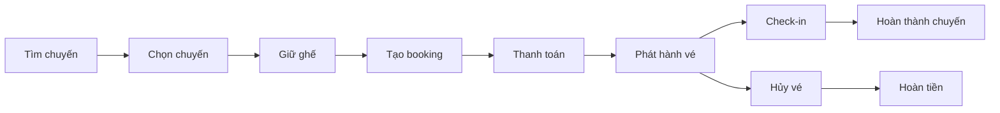

# Quy trình nghiệp vụ tổng quát

Tài liệu này nối phần actor với yêu cầu chi tiết. Mỗi quy trình chỉ mô tả mục tiêu, thứ tự xử lý và điểm quyết định nghiệp vụ; API, transaction và event được trình bày ở các phần kỹ thuật phía sau.

## 1. Bản đồ quy trình

| ID | Quy trình | Actor chính | Kết quả |
|---|---|---|---|
| BP-01 | Tìm chuyến và đặt vé | Customer | Booking được thanh toán và Ticket được phát hành |
| BP-02 | Hủy vé và hoàn tiền | Customer | Ticket bị hủy và Refund được xử lý |
| BP-03 | Đổi vé | Customer | Ticket mới thay thế Ticket cũ an toàn |
| BP-04 | Tạo và phát hành chuyến | Operator Staff | Trip sẵn sàng để bán |
| BP-05 | Vận hành chuyến và check-in | Driver, Operator Staff | Hành khách được xác nhận và Trip hoàn tất |
| BP-06 | Hủy chuyến | Operator Staff, Admin | Vé bị ảnh hưởng được hủy, hoàn tiền và thông báo |
| BP-07 | Quản lý tài khoản và nhà xe | Admin | User, role và tenant được quản lý có audit |

## 2. Vòng đời nghiệp vụ chính

Luồng trên là đường đi chuẩn. Các nhánh lỗi và bù trừ được mô tả trong [Ngoại lệ và khả năng phục hồi](../architecture/exceptions-and-recovery.md).

## 3. BP-01 — Tìm chuyến và đặt vé

### Mục tiêu

Customer tìm được chuyến phù hợp, giữ chính xác các ghế mong muốn, thanh toán và nhận vé mà không xảy ra double-booking.

### Tiền điều kiện

- Trip đã được publish và còn bán.
- Customer đã đăng nhập trước bước giữ ghế.
- Booking Service đã có TripSnapshot và TripSeat tương ứng.

### Luồng chuẩn

| Bước | Actor/Hệ thống | Hành động | Kết quả |
|---:|---|---|---|
| 1 | Guest/Customer | Nhập điểm đi, điểm đến, ngày đi, số khách | Search criteria hợp lệ |
| 2 | Transport Service | Tìm và trả danh sách Trip | Kết quả có giá và availability snapshot |
| 3 | Customer | Chọn Trip và xem sơ đồ ghế | Danh sách TripSeat được hiển thị |
| 4 | Customer | Chọn một hoặc nhiều ghế | Trạng thái `SELECTED` chỉ tồn tại ở client |
| 5 | Booking Service | Kiểm tra và giữ toàn bộ ghế trong một transaction | SeatHold `ACTIVE`, TripSeat `HELD` |
| 6 | Customer | Nhập Passenger và điểm đón/trả | Một Passenger cho mỗi ghế |
| 7 | Booking Service | Tính giá và tạo Booking từ SeatHold | Booking `PENDING_PAYMENT` |
| 8 | Customer | Chọn phương thức thanh toán | Payment intent được yêu cầu |
| 9 | Payment Gateway | Xử lý giao dịch và gửi webhook | Kết quả thanh toán có chữ ký |
| 10 | Payment Service | Xác minh và ghi nhận payment | Payment `SUCCEEDED` hoặc trạng thái thất bại |
| 11 | Booking Service | Xác nhận Booking/TripSeat và phát hành Ticket | Booking `PAID`, TripSeat `BOOKED`, Ticket `ISSUED` |
| 12 | Notification Service | Gửi xác nhận | Customer nhận thông tin vé |

### Điểm quyết định

- Có chuyến phù hợp hay không?
- Tất cả ghế còn `AVAILABLE` tại thời điểm giữ hay không?
- SeatHold còn hiệu lực khi tạo Booking/thanh toán hay không?
- Webhook có hợp lệ và đúng số tiền hay không?
- Payment đến trễ có còn khả năng xác nhận ghế hay phải compensation?

### Hậu điều kiện

- Thành công: Booking `PAID`, mỗi Passenger có một Ticket và mỗi TripSeat là `BOOKED`.
- Không thành công: không có hai Ticket còn hiệu lực cho cùng TripSeat; payment đã thu nhưng không thể cấp vé phải được hoàn hoặc đưa vào xử lý thủ công.

## 4. BP-02 — Hủy vé và hoàn tiền

| Bước | Actor/Hệ thống | Hành động | Kết quả |
|---:|---|---|---|
| 1 | Customer | Chọn Booking/Ticket muốn hủy | Yêu cầu preview |
| 2 | Booking Service | Kiểm tra ownership, trạng thái, giờ đi và policy snapshot | Kết luận đủ/không đủ điều kiện |
| 3 | Booking Service | Tính phí và số tiền hoàn | Cancellation preview |
| 4 | Customer | Xác nhận hủy | Command có idempotency key |
| 5 | Booking Service | Hủy Ticket và cập nhật ghế nếu còn bán được | Ticket `CANCELLED` |
| 6 | Payment Service | Xử lý Refund | Refund `PROCESSING/SUCCEEDED/FAILED` |
| 7 | Notification Service | Thông báo kết quả | Customer nhận trạng thái cuối |

Hủy quyền sử dụng vé và hoàn tiền là hai trạng thái khác nhau. Refund lỗi không được tự động khôi phục Ticket đã hủy.

## 5. BP-03 — Đổi vé

1. Customer chọn Ticket hiện tại và chuyến/ghế mới.
2. Booking Service kiểm tra policy đổi vé.
3. Hệ thống tạo SeatHold cho ghế mới trước khi tác động vé cũ.
4. Hệ thống tính phí đổi và chênh lệch giá.
5. Customer thanh toán thêm hoặc nhận refund phần chênh nếu cần.
6. Sau khi điều kiện tài chính hoàn tất, Ticket mới được phát hành và Ticket cũ bị hủy.
7. Nếu bất kỳ bước nào thất bại trước commit cuối, ghế mới được giải phóng và Ticket cũ giữ nguyên.

Đây là quy trình SHOULD; khi chưa triển khai phải ẩn khỏi client và API public.

## 6. BP-04 — Tạo và phát hành chuyến

| Bước | Actor/Hệ thống | Hành động | Kết quả |
|---:|---|---|---|
| 1 | Operator Scheduler | Chọn route, bus, driver, lịch, giá và policy | Trip draft |
| 2 | Transport Service | Kiểm tra dữ liệu và tenant | Draft hợp lệ |
| 3 | Transport Service | Kiểm tra trùng lịch bus/driver và license | Không có xung đột |
| 4 | Operator Scheduler | Xác nhận publish | Trip `SCHEDULED` |
| 5 | Transport Service | Phát `TripPublished` | Snapshot được công bố |
| 6 | Booking Service | Tạo TripSnapshot và TripSeat | Inventory sẵn sàng |
| 7 | Search/read model | Đánh dấu Trip sellable | Người dùng có thể tìm và đặt |

Trip chỉ được hiển thị để bán sau khi seat inventory đã được tạo thành công.

## 7. BP-05 — Vận hành chuyến và check-in

1. Driver xem các Trip được phân công.
2. Driver/Operator mở manifest tối thiểu của Trip.
3. Hành khách xuất trình QR hoặc mã vé.
4. Booking Service xác minh Ticket, Trip, trạng thái và quyền actor.
5. Ticket hợp lệ chuyển `ISSUED → CHECKED_IN`; scan lặp trả kết quả đã check-in.
6. Driver cập nhật Trip theo `BOARDING → DEPARTED → IN_TRANSIT → ARRIVED`.
7. Trip chuyển `COMPLETED`; Ticket đã check-in chuyển `USED`.

## 8. BP-06 — Hủy chuyến

1. Operator có quyền chọn Trip và nhập lý do hủy.
2. Transport Service kiểm tra quy tắc chuyển trạng thái và chuyển Trip sang `CANCELLED` theo cơ chế idempotent.
3. `TripCancelled` được phát qua outbox.
4. Booking Service xác định Booking/Ticket bị ảnh hưởng và hủy quyền sử dụng.
5. Refund được tạo cho các khoản đã thanh toán theo chính sách hủy bởi nhà xe.
6. Notification Service thông báo Customer; Reporting cập nhật read model.
7. Operations theo dõi các refund thất bại hoặc event trong DLQ.

## 9. BP-07 — Quản lý tài khoản và nhà xe

1. Admin tạo hoặc phê duyệt Operator Organization.
2. Admin thêm User vào Organization với role phù hợp.
3. Identity Service phát token chứa user identity và tenant scope.
4. Mỗi service tự kiểm tra role, permission và `organizationId` khi xử lý request.
5. Thay đổi role, membership hoặc trạng thái tài khoản được audit và có thể thu hồi phiên.

## 10. Liên kết sang đặc tả chi tiết

| Quy trình | Yêu cầu chức năng | Quy tắc nghiệp vụ | Use Case |
|---|---|---|---|
| BP-01 | FR-SEARCH, FR-BOOK, FR-PAY, FR-TICKET | BR-SEAT, BR-BOOK, BR-PAY | UC-SEARCH-01, UC-BOOK-01, UC-PAY-01 |
| BP-02 | FR-BOOK-009, FR-PAY-008 | BR-CANCEL, BR-PAY | UC-CANCEL-01 |
| BP-03 | FR-BOOK-010 | BR-CANCEL-006..007 | UC-CHANGE-01 |
| BP-04 | FR-OPS-004..006 | BR-TRIP-001..002 | UC-OPS-01 |
| BP-05 | FR-OPS-007/010, FR-TICKET | BR-TRIP, BR-TICKET | UC-DRIVER-01 |
| BP-06 | FR-OPS-008 | BR-CANCEL-008, BR-TRIP-004..006 | UC-TRIP-01 |
| BP-07 | FR-IAM-008..009, FR-ADMIN-001 | BR-TENANT, AUTHZ | UC-ADMIN-01 |
