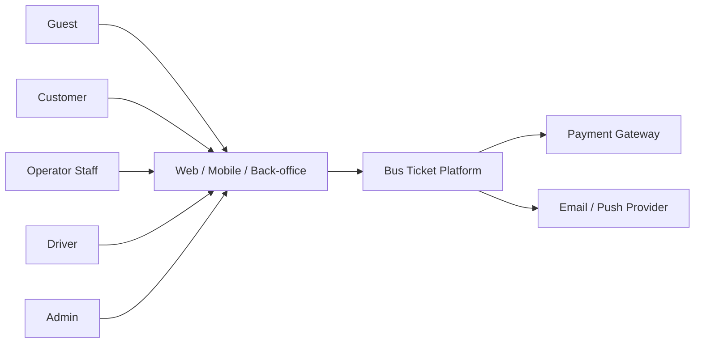

# Phạm vi và bối cảnh hệ thống

## 1. System context



## 2. Ranh giới hệ thống

### Bên trong

- API Gateway.
- Identity, Transport, Booking, Payment, Notification và Reporting Service.
- Database/schema thuộc từng service.
- Redis, message broker, object storage và observability stack.
- Web End-user, Mobile App và Back-office Web.

### Bên ngoài

- Payment Gateway.
- Email/SMS/push provider.
- Hệ thống bản đồ/geocoding nếu được chọn sau này.

Hệ thống không cam kết SLA của bên ngoài nhưng phải có timeout, retry có giới hạn, idempotency và cơ chế xử lý thủ công khi tích hợp lỗi.

## 3. Luồng nghiệp vụ cấp cao

### Customer

```text
Search → View Trip → Hold Seats → Create Booking → Pay → Receive Ticket
                                                  ↘ Cancel/Refund
```

### Operator

```text
Manage Fleet → Manage Routes → Publish Trip → Monitor Bookings → Operate Trip
```

### Driver

```text
View Assignment → View Manifest → Scan/Enter Ticket → Check In Passenger → Complete Trip
```

### Admin

```text
Manage Organizations/Users → Moderate Content → Audit Transactions → View Platform Reports
```

## 4. Giả định và phụ thuộc

- Thiết bị client có kết nối Internet.
- Payment Gateway hỗ trợ HTTPS callback/webhook và mã giao dịch duy nhất.
- Email/push provider có API hoặc SMTP phù hợp.
- Nhà xe chịu trách nhiệm về độ chính xác của lịch chạy, điểm đón/trả và chính sách.
- Một chuyến đã publish có snapshot cấu hình xe/ghế; thay đổi sơ đồ xe không được làm biến đổi vé đã bán.
- Giá trị tiền mặc định là VND và lưu bằng số nguyên đồng hoặc kiểu decimal, không dùng floating point.

## 5. Ràng buộc

- API truyền dữ liệu qua HTTPS và JSON UTF-8.
- Public API được version hóa dưới `/api/v1`.
- Dịch vụ phải chạy được bằng container.
- Dữ liệu nhạy cảm không xuất hiện trong log.
- Mobile version cũ phải nhận lỗi nâng cấp rõ ràng khi API không còn tương thích.
- Các mốc thời gian nghiệp vụ sử dụng timezone của chuyến; baseline là `Asia/Ho_Chi_Minh`.

## 6. Thuật ngữ

| Thuật ngữ | Định nghĩa |
|---|---|
| Operator Organization | Pháp nhân/nhà xe sở hữu dữ liệu vận hành |
| Operator Staff | User thuộc một Operator Organization |
| Seat | Ghế vật lý trong sơ đồ xe |
| TripSeat | Bản ghi ghế của một chuyến cụ thể |
| SeatHold | Quyền giữ tạm một hoặc nhiều TripSeat có thời hạn |
| Booking | Đơn đặt chỗ chứa một hoặc nhiều hành khách/vé |
| Ticket | Quyền đi xe của một hành khách tại một ghế |
| Payment Attempt | Một lần thử thanh toán qua provider |
| Refund | Yêu cầu hoàn tiền toàn phần hoặc một phần |
| Idempotency | Gửi lặp cùng request không tạo thêm tác động nghiệp vụ |
| Tenant | Phạm vi dữ liệu của một Operator Organization |
