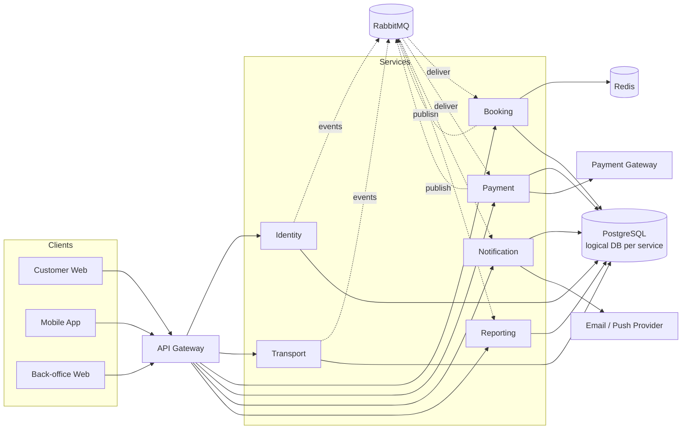

# 2.1.2 Architecture Overview

## 1. Kiểu kiến trúc

Hệ thống dùng Microservices theo bounded context, kết hợp:

- **Layered entry:** Client → Edge/API Gateway → Business Services.
- **Database per service:** mỗi service là single writer cho dữ liệu của mình.
- **Event-driven integration:** RabbitMQ phân phối integration event và asynchronous command.
- **CQRS có chọn lọc:** Reporting và các snapshot đọc được dựng từ event; command model vẫn nằm ở service sở hữu nghiệp vụ.
- **Saga choreography:** các service phản ứng theo event và phát event/command bù trừ, không có transaction coordinator toàn cục.

## 2. Logical view

Ký hiệu `PG` trong sơ đồ là một PostgreSQL cluster vật lý có nhiều logical database/schema và credential tách biệt; nó không phải shared database ở mức quyền sở hữu.

## 3. Luồng xử lý chính

### 3.1 Tìm chuyến và giữ ghế

1. Client gọi Gateway; Gateway xác thực/rate-limit và chuyển request tới Transport hoặc Booking.
2. Transport trả thông tin chuyến; Booking trả TripSeat snapshot và trạng thái khả dụng.
3. Booking dùng transaction trên database để tạo SeatHold; Redis có thể hỗ trợ TTL nhưng không quyết định quyền sở hữu ghế.
4. Response đồng bộ trả `holdToken`, price snapshot và `expiresAt`.

### 3.2 Thanh toán và phát hành vé

1. Client yêu cầu Payment Service tạo payment intent bằng `bookingId` và `Idempotency-Key`.
2. Payment Gateway gửi signed webhook trực tiếp đến integration endpoint của Payment Service.
3. Payment persist kết quả và `PaymentSucceeded` trong cùng transaction qua outbox.
4. Outbox publisher gửi event đến RabbitMQ; Booking consumer dedupe bằng inbox.
5. Booking xác nhận ghế, chuyển booking sang `PAID`, tạo ticket và phát `BookingPaid`/`TicketIssued`.
6. Notification gửi vé; Reporting cập nhật projection. Hai bước này không chặn kết quả payment.

### 3.3 Hủy và hoàn tiền

1. Booking kiểm tra policy snapshot rồi commit trạng thái hủy.
2. Booking phát integration event `RefundRequested` qua outbox/RabbitMQ.
3. Payment gọi Payment Gateway, persist kết quả và phát `RefundSucceeded` hoặc `RefundFailed`.
4. Booking cập nhật aggregate; Notification và Reporting xử lý eventual consistency.

## 4. Consistency model

| Phạm vi | Mô hình |
|---|---|
| Trong một service/database | Strong consistency bằng local transaction |
| Giữ ghế và phát hành ticket | Serialize tại Booking Service; constraint/lock bảo vệ invariant |
| Giữa Booking và Payment | Eventual consistency qua saga; trạng thái trung gian là hợp lệ và quan sát được |
| Notification/Reporting | Eventual consistency; không thuộc critical path |
| Cache/Redis | Có thể stale; luôn có đường đọc/ghi về source of truth |

## 5. Trust boundaries

- **Public zone:** browser/mobile/back-office và webhook ingress.
- **Edge zone:** WAF/reverse proxy/API Gateway; chỉ public component này được gọi business API.
- **Application zone:** stateless service workloads và RabbitMQ client connections.
- **Data zone:** PostgreSQL, Redis, RabbitMQ management endpoint; không public Internet.
- **External zone:** Payment Gateway và Email/Push Provider; mọi egress được allowlist, timeout và audit phù hợp.

## 6. Cross-cutting concerns

Mỗi request/message phải mang `correlationId`; trace context được truyền bằng HTTP header và AMQP header. Mọi service áp dụng cùng chuẩn error envelope, structured logging, metrics, health/readiness, secret injection và audit nhưng vẫn giữ business logic trong service sở hữu miền.
