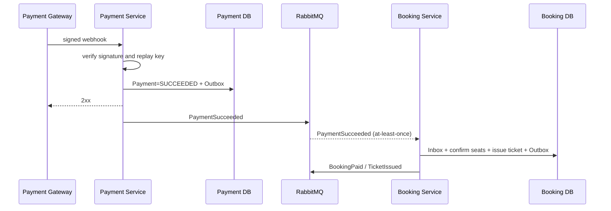

# 2.1.5 Service Communication

## 1. Nguyên tắc chọn cơ chế

| Nhu cầu | Cơ chế | Lý do |
|---|---|---|
| Caller cần kết quả để trả response hiện tại | REST/HTTPS đồng bộ | Semantics rõ, dễ kiểm soát timeout và error |
| Thông báo một sự thật đã commit cho nhiều consumer | RabbitMQ integration event | Fan-out, giảm coupling, consumer độc lập |
| Giao việc không cần hoàn tất trong request hiện tại | RabbitMQ asynchronous command | Hấp thụ burst, retry và failure isolation |
| Dữ liệu đọc thường xuyên từ context khác | Local snapshot/projection cập nhật bằng event | Tránh sync chain và query database chéo |
| Batch/export dài | Async job + trạng thái polling/download | Không giữ HTTP connection lâu |

Không dùng event để giả lập RPC. Nếu caller không thể tiếp tục khi chưa có kết quả, dùng REST với timeout rõ hoặc thiết kế workflow có trạng thái `PENDING`.

## 2. Synchronous communication

### 2.1 Quy ước HTTP

- Public base path: `/api/v1`; JSON UTF-8; thời gian ISO-8601 có timezone và lưu UTC.
- Gateway tạo `X-Correlation-ID` nếu client không gửi và forward tới downstream.
- `traceparent` được propagate theo W3C Trace Context.
- `Authorization: Bearer <token>`; service tự kiểm tra quyền và tenant scope.
- `Idempotency-Key` bắt buộc cho hold, booking, payment, cancel và refund command.
- Error dùng envelope có `code`, safe `message`, `details` và `correlationId`.
- API list dùng pagination; response lớn hoặc xử lý > 10 giây chuyển sang export job.

### 2.2 Resilience policy

| Control | Baseline |
|---|---|
| Timeout | Có connect timeout và overall deadline; downstream không được dài hơn deadline còn lại của request |
| Retry | Tối đa ít lần, exponential backoff + jitter; chỉ GET hoặc command có idempotency bảo đảm |
| Circuit breaker | Áp dụng cho provider và dependency có nguy cơ cascade; half-open probe có giới hạn |
| Bulkhead | Tách connection pool/thread pool cho critical API và background/provider work |
| Rate limit | Theo IP/account/client ở Gateway; endpoint auth/webhook có policy riêng |
| Fallback | Chỉ trả cache/stale data khi use case cho phép và response ghi rõ độ mới |

Giá trị timeout/retry cụ thể phải nằm trong configuration theo môi trường và được load test; không hard-code một con số cho mọi dependency.

## 3. Asynchronous communication

### 3.1 Message types

- **Integration event:** sự thật quá khứ, ví dụ `PaymentSucceeded` hoặc `RefundRequested` sau khi logical refund đã được chấp nhận; có thể có nhiều consumer.
- **Asynchronous command:** yêu cầu một owner thực hiện việc, ví dụ `PaymentCompensationRequested`; chỉ một logical consumer group.

Tên event dùng quá khứ; tên command diễn đạt hành động. Consumer không dựa vào queue name để đoán schema mà dựa vào `eventType`/`commandType` và `version`.

### 3.2 Delivery contract

- RabbitMQ cung cấp at-least-once, vì vậy duplicate là bình thường.
- Producer ghi business state và outbox trong cùng local transaction.
- Publisher chỉ đánh dấu outbox `PUBLISHED` sau publisher confirm.
- Consumer dùng manual acknowledgement; chỉ ack sau khi local transaction thành công.
- Consumer ghi inbox/deduplication cùng transaction với side effect.
- Message lỗi transient đi qua retry có backoff; lỗi permanent hoặc quá số lần thử vào DLQ.

## 4. Consistency và ordering

- Không giả định ordering toàn hệ thống.
- Event của cùng aggregate mang `aggregateId` và `aggregateVersion` khi thứ tự quan trọng.
- Consumer bỏ qua version đã xử lý; khi thấy gap có thể retry hoặc đối soát từ API owner.
- Nhiều consumer instance trên một queue có thể xử lý song song; invariant vẫn phải được database guard bảo vệ.
- Clock time không dùng thay aggregate version để quyết định event mới/cũ.

## 5. Luồng payment thành công

Webhook acknowledgement không chờ Booking, Notification hoặc Reporting. Client đọc trạng thái `PENDING/PROCESSING` và poll hoặc nhận cập nhật phù hợp cho đến khi saga hội tụ.

## 6. Contract evolution

- API breaking change tạo major path/version mới hoặc có giai đoạn tương thích.
- Message cùng version chỉ được thêm field optional; đổi semantics, rename hoặc xóa field phải tăng version.
- Producer phải hỗ trợ overlap đủ lâu để consumer nâng cấp độc lập.
- CI kiểm tra OpenAPI/event schema, backward compatibility và contract test.
- Không đưa class nội bộ/ORM entity trực tiếp lên wire contract.

## 7. Failure ownership

Caller sở hữu timeout và trải nghiệm người dùng; callee sở hữu correctness và idempotency của operation. Producer sở hữu schema và publish reliability; consumer sở hữu retry classification, deduplication và DLQ runbook của queue mình.
