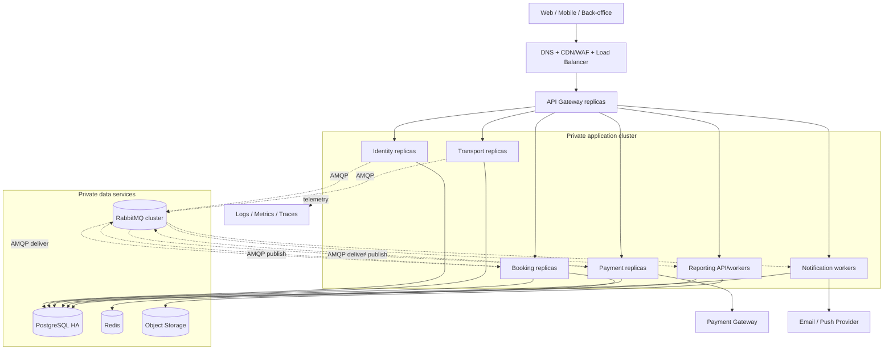

# 2.1.9 Deployment Architecture

## 1. Deployment principles

- Build một container image bất biến cho mỗi deployable service; cùng image được promote qua môi trường.
- Service stateless ở process memory để scale/restart không mất session nghiệp vụ.
- Config ngoài image; secret lấy từ secret store/environment injection.
- Database, RabbitMQ và Redis không public Internet.
- Migration tương thích rolling deployment và được chạy như bước có kiểm soát.
- Liveness chỉ trả lời process có cần restart; readiness kiểm tra khả năng phục vụ traffic thiết yếu.

## 2. Local/demo topology

Docker Compose là baseline cho developer và demo:

```text
reverse-proxy / api-gateway
identity-service        → identity_db
transport-service       → transport_db
booking-service         → booking_db + redis
payment-service         → payment_db
notification-service    → notification_db
reporting-service       → reporting_db
rabbitmq                → durable volume + management UI bound to localhost/admin network
postgresql              → logical DB/role per service
redis                   → cache/TTL helper
observability (optional local profile)
```

Compose dùng internal network cho service/data. Chỉ Gateway, các client dev port cần thiết và RabbitMQ management ở localhost được expose. Local credential là development-only và không được tái sử dụng ở môi trường shared.

## 3. Production-like logical topology



Một PostgreSQL HA cluster có thể phục vụ nhiều logical database ở quy mô ban đầu. Khi contention, compliance hoặc recovery profile khác biệt, một logical database có thể chuyển sang cluster riêng mà không đổi service contract.

## 4. Workload layout

| Workload | Replica baseline | Autoscale signal | Ghi chú |
|---|---:|---|---|
| API Gateway | 2+ | Request rate, CPU, latency | Tránh single public entry failure |
| Identity/Transport API | 2+ | CPU, request rate, p95 latency | Transport search có thể scale riêng |
| Booking/Payment API | 2+ | Request rate, latency, DB contention | Readiness phải phản ánh dependency thiết yếu |
| Outbox publisher | 1+ | Outbox age/count | Claim row an toàn khi nhiều instance |
| RabbitMQ consumers | 1+ | Queue age/backlog, processing rate | Competing consumer trong cùng logical queue |
| Notification workers | 1+ | Queue backlog, provider quota | Bulkhead tách provider channel |
| Reporting API/workers | 1+ | Query latency, export queue | Export tách khỏi online report |

Con số replica là production-like baseline, không phải capacity plan cuối. Load test quyết định request/limit và autoscaling threshold.

## 5. Network policy

| Source | Destination | Cho phép |
|---|---|---|
| Internet | Edge/Gateway | HTTPS public route đã công bố |
| Payment Provider | Payment webhook route | HTTPS, signature verification, rate/source control nếu provider hỗ trợ |
| Gateway | Business services | Internal HTTP/HTTPS theo route allowlist |
| Service | DB của chính service | PostgreSQL bằng credential riêng |
| Service | RabbitMQ | AMQPS và vhost permission riêng |
| Booking | Redis | Private Redis protocol/TLS theo hạ tầng |
| Payment/Notification | Provider tương ứng | Controlled egress HTTPS |
| Operator/CI | Data/admin plane | Qua admin network/bastion/workload identity, có audit |

Mọi đường khác deny by default. Network policy hỗ trợ nhưng không thay application authorization.

## 6. Health và rollout

- `/live`: process/event loop hoạt động; không phụ thuộc mọi external provider.
- `/ready`: dependency bắt buộc để nhận loại workload tương ứng đang usable.
- `/metrics`: chỉ private scrape endpoint.
- Rolling update dùng readiness gate và graceful shutdown; consumer ngừng nhận message mới rồi hoàn tất/nack công việc đang xử lý.
- API version N và N-1 overlap khi có breaking migration.
- Rollback code chỉ an toàn khi schema migration vẫn backward-compatible.

## 7. RabbitMQ deployment

- Local: single node, durable volume, management plugin.
- Production-like: số node lẻ, quorum queue cho critical queues, persistent disk và anti-affinity.
- Pod/node disruption budget tránh mất quorum trong planned maintenance.
- Alert disk/memory alarm, unavailable quorum, oldest-message age, DLQ và publisher confirm timeout.
- Definition/policy được quản lý như code; không chỉnh topology production bằng thao tác tay không truy vết.

## 8. Database và backup deployment

- PostgreSQL HA/managed capability có automated backup và PITR để đạt RPO/RTO.
- Connection pool có giới hạn theo tổng replica; scale application không được làm cạn DB connection.
- Read replica chỉ dùng cho query cho phép lag; không dùng kiểm tra seat/payment invariant.
- Backup/restore, failover và migration được diễn tập; dashboard hiển thị backup age và restore test gần nhất.

## 9. Observability

- Log tập trung dạng structured JSON với UTC, service, environment, level, correlation ID và error code.
- Metrics: RED cho API, DB pool/query, RabbitMQ/outbox/inbox, hold expiry, payment/refund và provider latency.
- Distributed trace qua Gateway → service và qua AMQP header cho Booking–Payment flow.
- Alert có owner/runbook; không alert chỉ vì một metric tức thời nếu không ảnh hưởng SLO.

## 10. Environment strategy

| Environment | Mục đích | Data |
|---|---|---|
| Local | Dev, contract/integration test | Synthetic fixture |
| CI | Unit, contract, migration, security scan | Ephemeral synthetic |
| Staging | E2E, load rehearsal, provider sandbox | Masked/synthetic; không dùng raw production dump |
| Production | User traffic | Real data với retention/audit đầy đủ |

Mỗi môi trường có vhost, database, secret và provider credential tách biệt.
