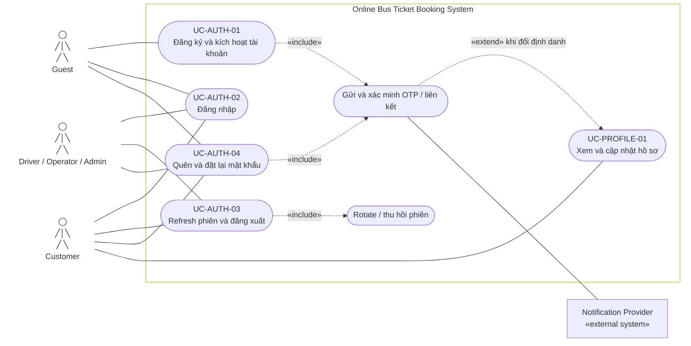

# 2.2.1 Use Case Diagram — Định danh và hồ sơ

Nguồn đặc tả: [Định danh và hồ sơ](../../srs-v2/04-use-cases/01-identity-and-profile.md).

`Guest` khởi tạo đăng ký/khôi phục; mọi nhóm user dùng đăng nhập và quản lý phiên. Xác minh định danh chỉ mở rộng cập nhật hồ sơ khi Customer thay email hoặc số điện thoại.
