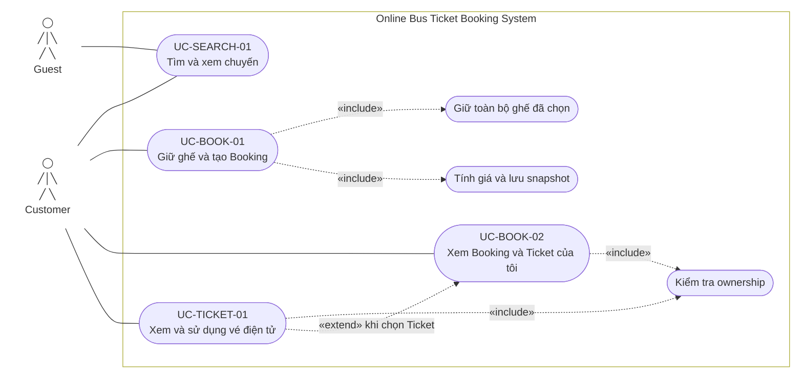

# 2.2.2 Use Case Diagram — Tìm chuyến, Booking và Ticket

Nguồn đặc tả: [Tìm chuyến, Booking và Ticket](../../srs-v2/04-use-cases/02-search-booking-ticket.md).

Guest chỉ tìm/xem chuyến. Giữ ghế, Booking và Ticket yêu cầu Customer đã xác thực; hệ thống luôn kiểm tra ownership ở server.
