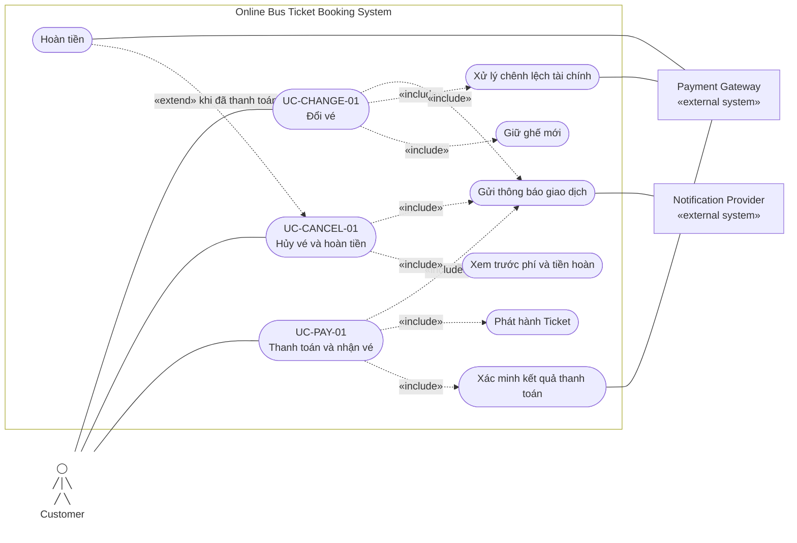

# 2.2.3 Use Case Diagram — Payment, hủy và đổi vé

Nguồn đặc tả: [Payment, hủy và đổi vé](../../srs-v2/04-use-cases/03-payment-cancellation-change.md).

Payment Gateway chỉ hỗ trợ xử lý và xác minh giao dịch; hệ thống mới là bên quyết định Booking/Ticket. Hoàn tiền mở rộng hủy vé khi giao dịch đã thanh toán và refund amount lớn hơn 0.
