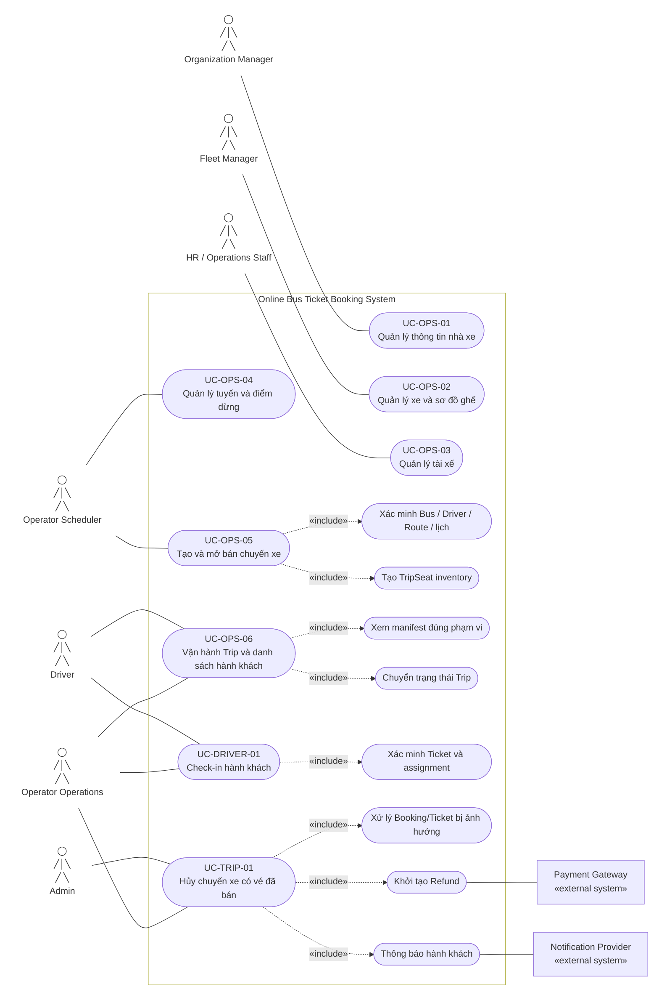

# 2.2.4 Use Case Diagram — Vận hành nhà xe, Trip và check-in

Nguồn đặc tả: [Vận hành nhà xe, Trip và check-in](../../srs-v2/04-use-cases/04-operator-trip-checkin.md).

Các actor Operator được tách theo permission thay vì coi mọi nhân viên nhà xe có cùng quyền. Driver chỉ truy cập Trip được assignment; Admin chỉ tham gia luồng hủy Trip khi có quyền tương ứng.
