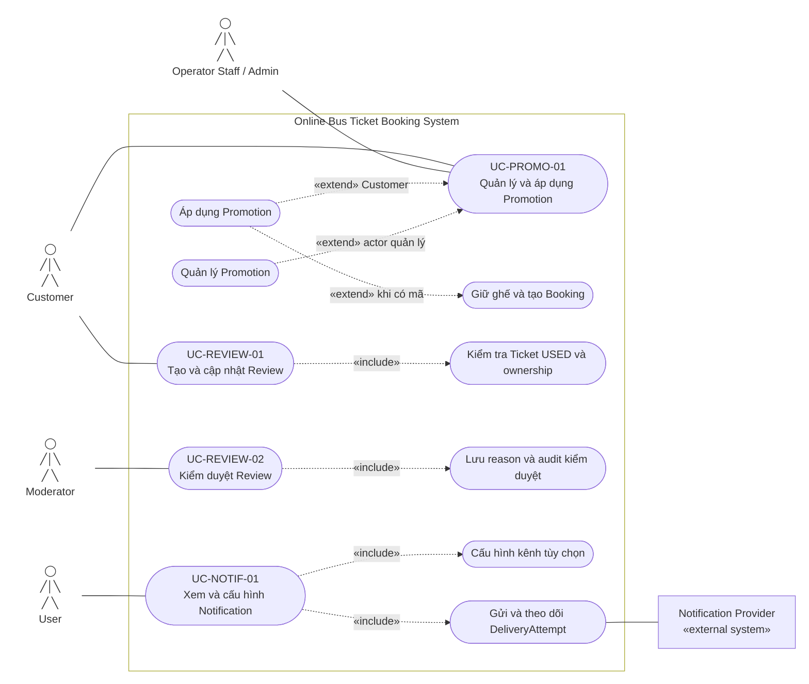

# 2.2.5 Use Case Diagram — Promotion, Review và Notification

Nguồn đặc tả: [Promotion, Review và Notification](../../srs-v2/04-use-cases/05-promotion-review-notification.md).

Áp dụng Promotion là hành vi tùy chọn khi Customer cung cấp mã. Notification Provider chỉ thực hiện delivery, không quyết định trạng thái Booking, Payment, Ticket hoặc Refund.
