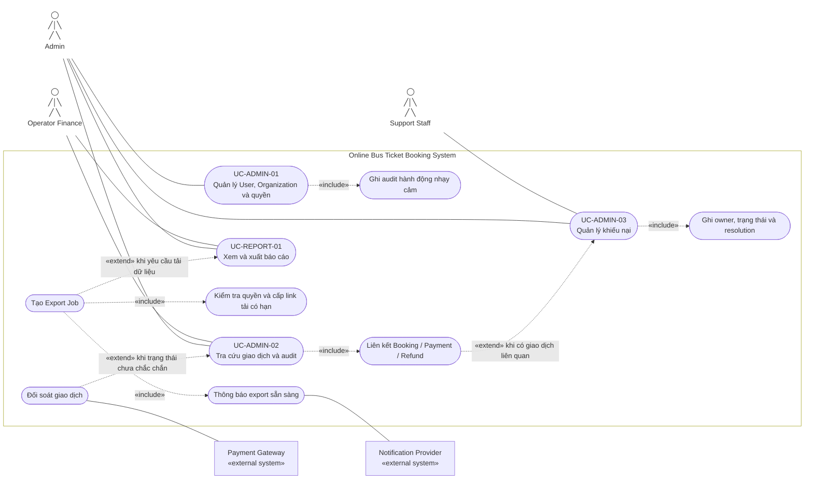

# 2.2.6 Use Case Diagram — Quản trị và báo cáo

Nguồn đặc tả: [Quản trị và báo cáo](../../srs-v2/04-use-cases/06-administration-reporting.md).

Operator Finance luôn bị giới hạn theo tenant. Link export không tự trao quyền; hệ thống kiểm tra lại authorization tại thời điểm tải.
