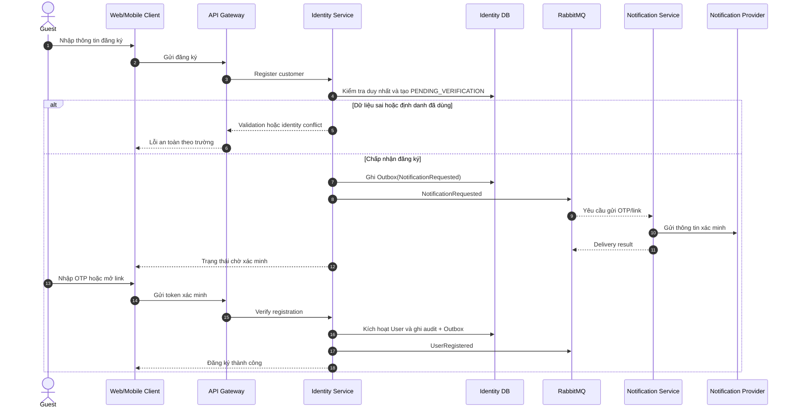
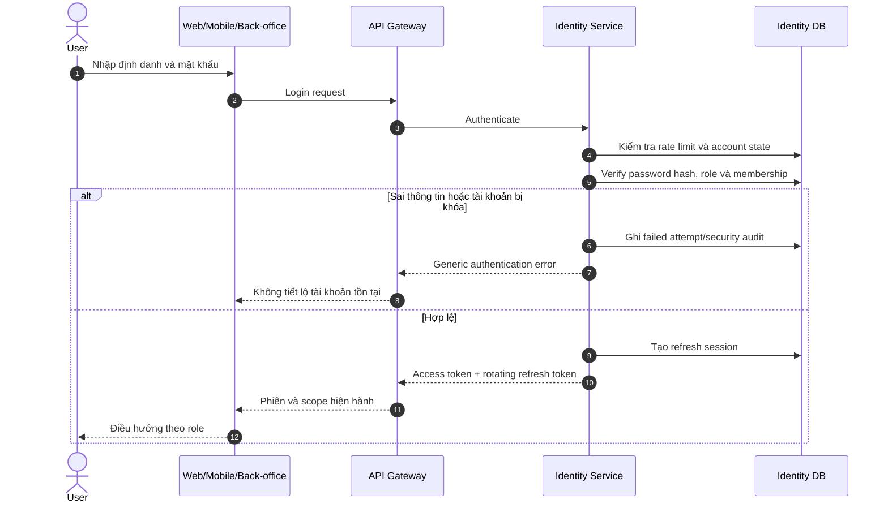
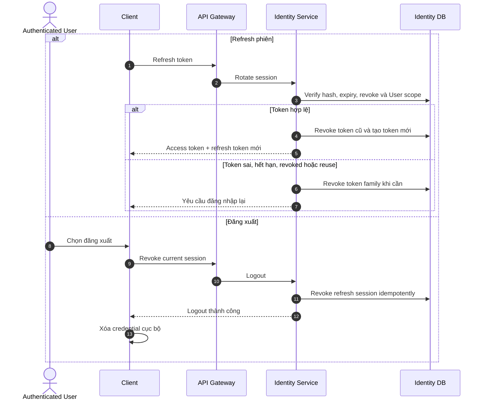
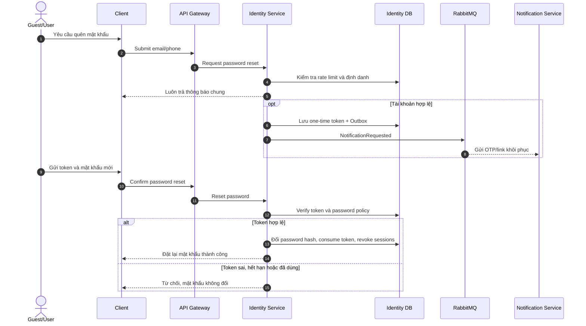
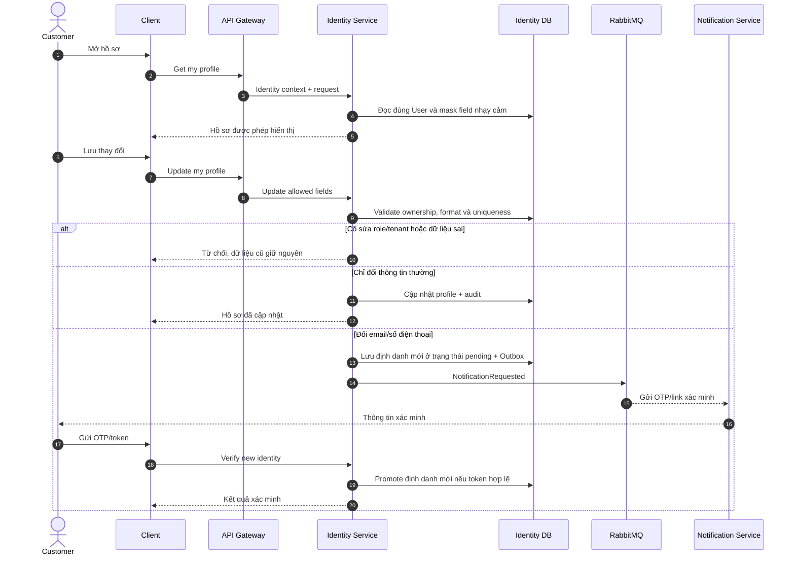

# 2.3.1 Định danh và hồ sơ

Nguồn nghiệp vụ: [SRS — Định danh và hồ sơ](../../srs-v2/04-use-cases/01-identity-and-profile.md).

## UC-AUTH-01 — Đăng ký và kích hoạt tài khoản

## UC-AUTH-02 — Đăng nhập

## UC-AUTH-03 — Refresh phiên và đăng xuất

## UC-AUTH-04 — Quên và đặt lại mật khẩu

## UC-PROFILE-01 — Xem và cập nhật hồ sơ

