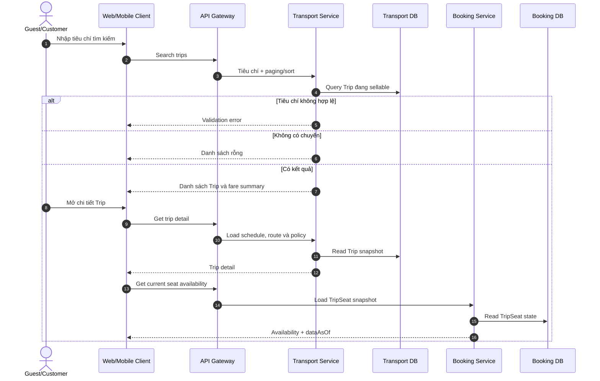
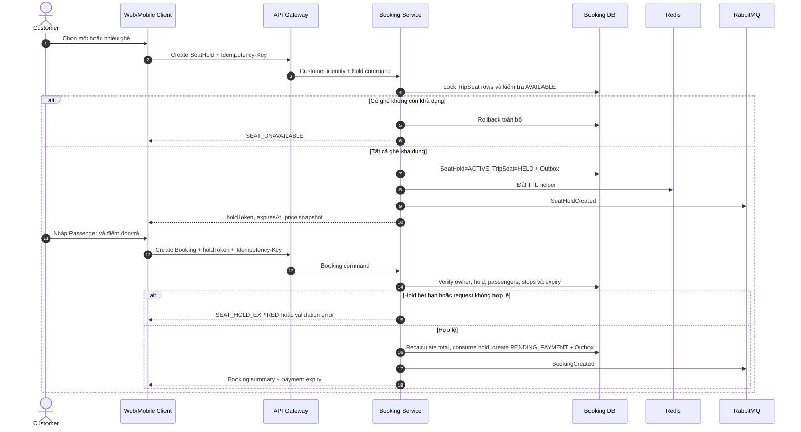
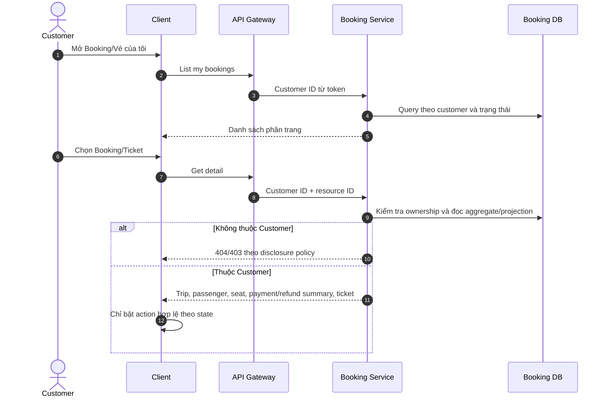
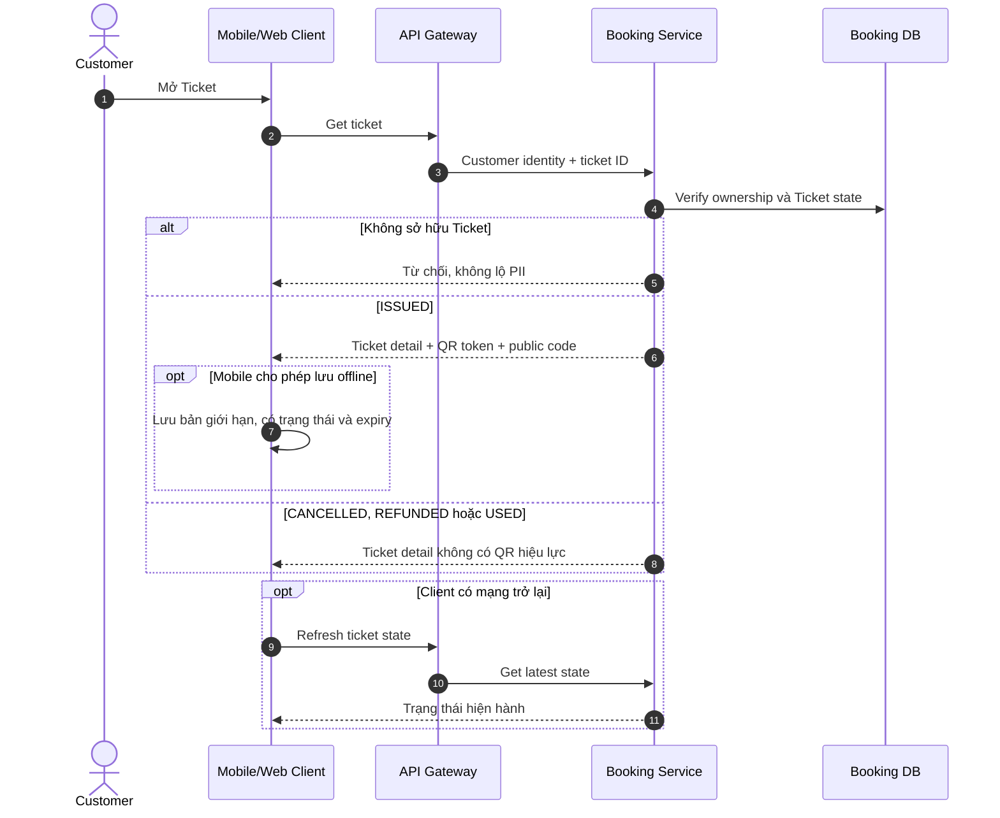

# 2.3.2 Tìm chuyến, Booking và Ticket

Nguồn nghiệp vụ: [SRS — Tìm chuyến, Booking và Ticket](../../srs-v2/04-use-cases/02-search-booking-ticket.md).

## UC-SEARCH-01 — Tìm và xem chuyến

## UC-BOOK-01 — Giữ ghế và tạo Booking

## UC-BOOK-02 — Xem Booking và Ticket của tôi

## UC-TICKET-01 — Xem và sử dụng vé điện tử

