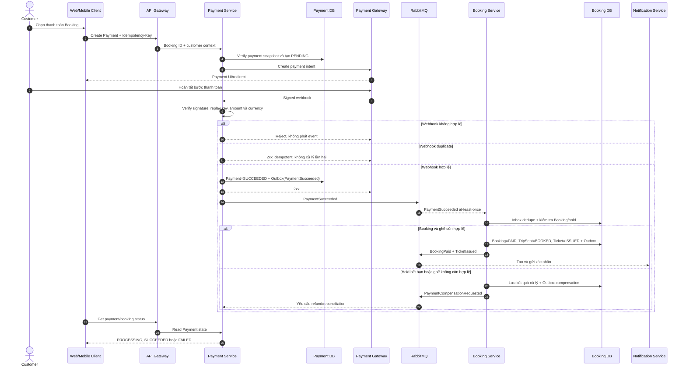
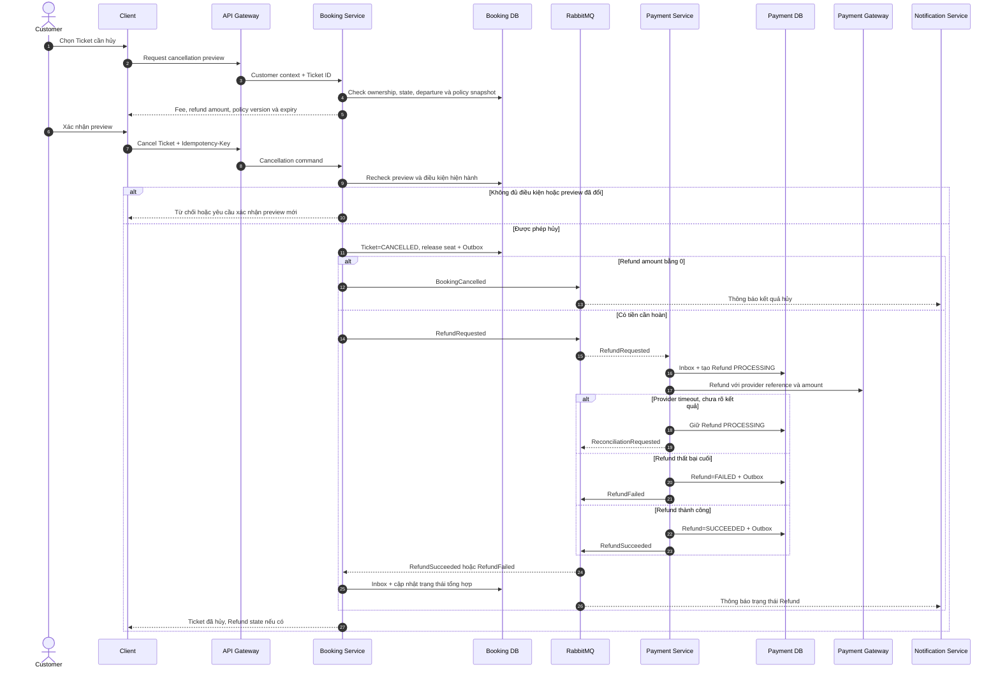
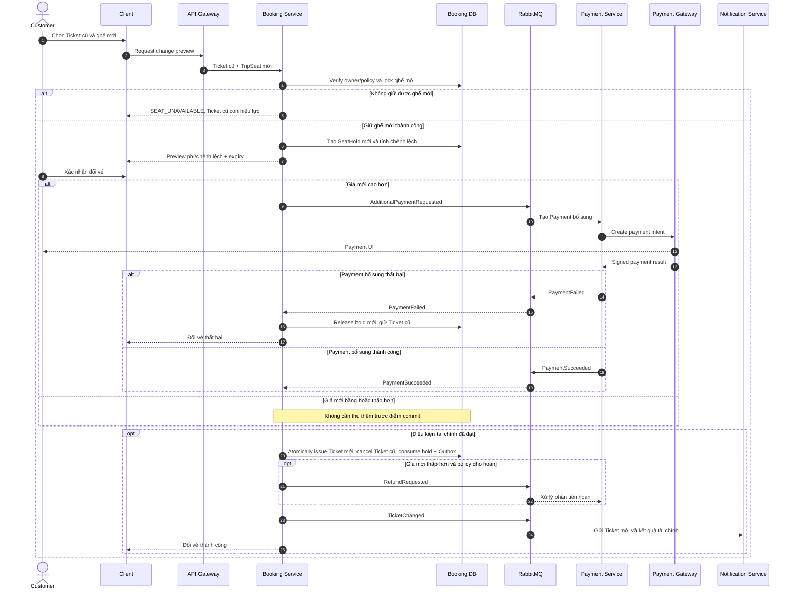

# 2.3.3 Payment, hủy và đổi vé

Nguồn nghiệp vụ: [SRS — Payment, hủy và đổi vé](../../srs-v2/04-use-cases/03-payment-cancellation-change.md).

## UC-PAY-01 — Thanh toán và nhận vé

## UC-CANCEL-01 — Hủy vé và hoàn tiền

## UC-CHANGE-01 — Đổi vé

Nếu Payment bổ sung đã thành công nhưng bước đổi vé không thể commit, Booking phải phát compensation để hoàn khoản bổ sung và giữ Ticket cũ; trường hợp không tự phục hồi được chuyển manual case có audit.
