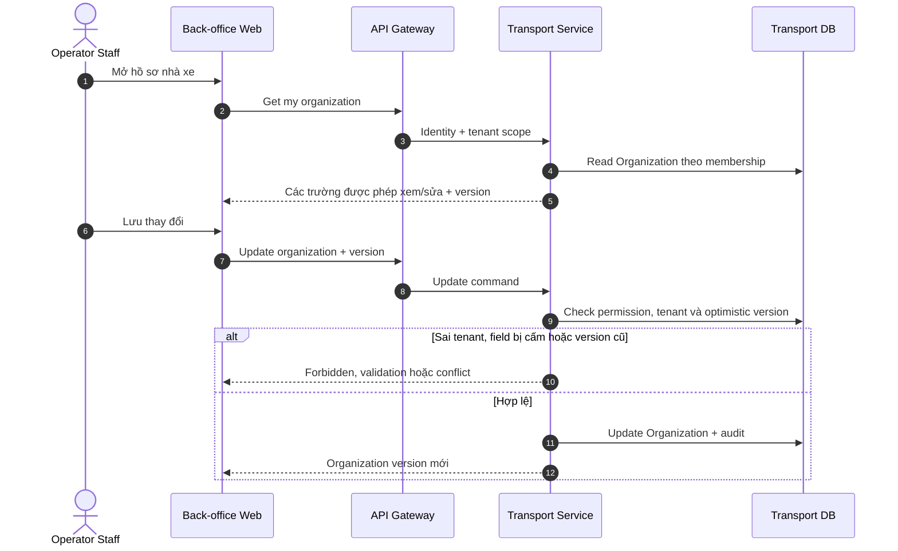
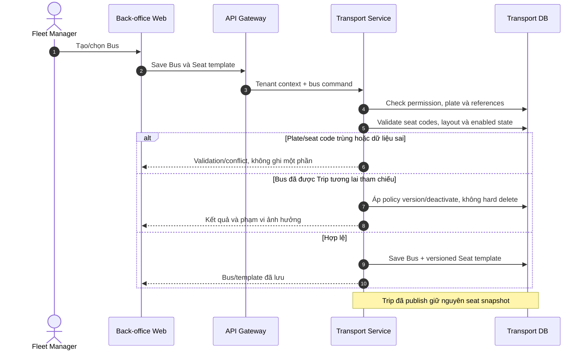
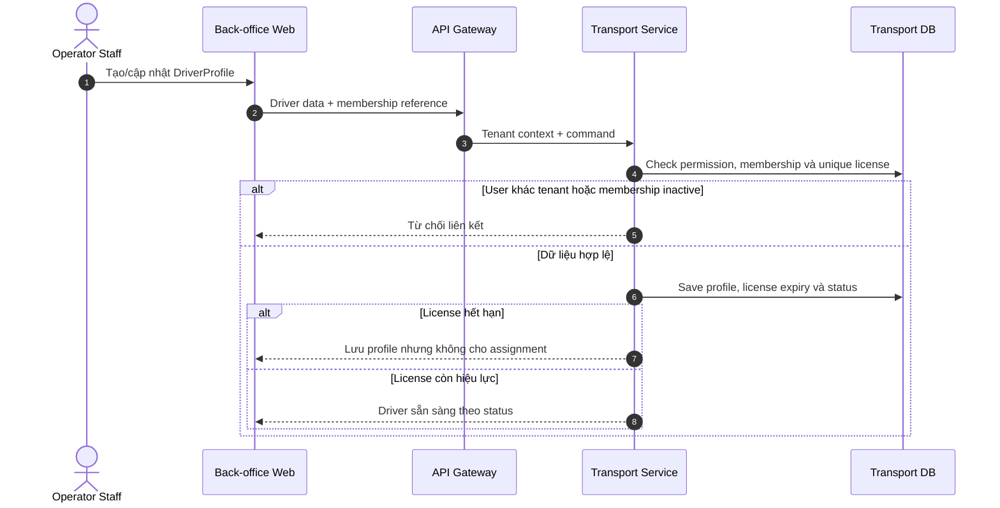
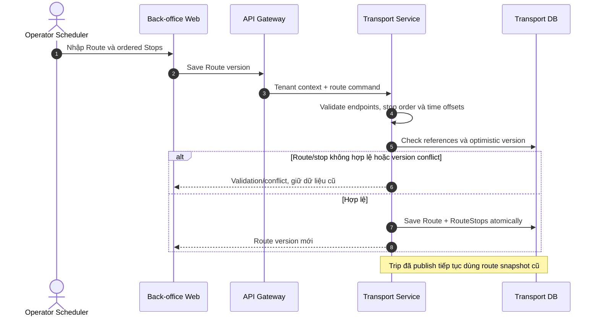
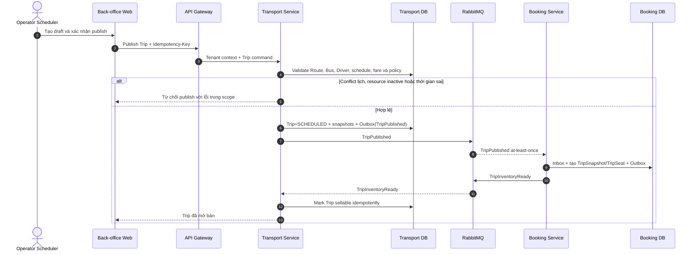
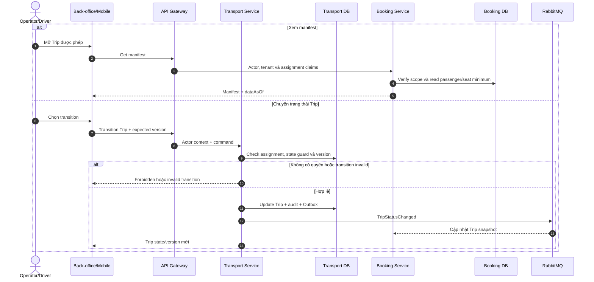
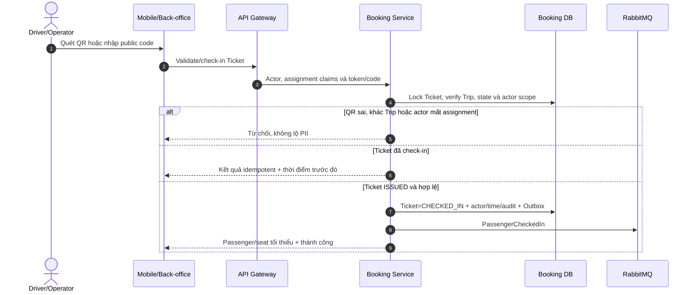
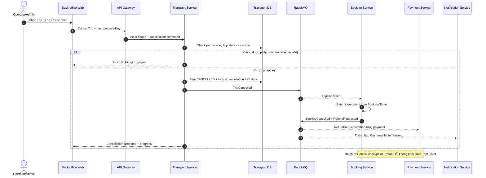

# 2.3.4 Vận hành nhà xe, Trip và check-in

Nguồn nghiệp vụ: [SRS — Vận hành nhà xe, Trip và check-in](../../srs-v2/04-use-cases/04-operator-trip-checkin.md).

## UC-OPS-01 — Quản lý thông tin nhà xe

## UC-OPS-02 — Quản lý xe và sơ đồ ghế

## UC-OPS-03 — Quản lý tài xế

## UC-OPS-04 — Quản lý tuyến và điểm dừng

## UC-OPS-05 — Tạo và mở bán chuyến xe

## UC-OPS-06 — Vận hành Trip và danh sách hành khách

## UC-DRIVER-01 — Check-in hành khách

## UC-TRIP-01 — Hủy chuyến xe có vé đã bán

