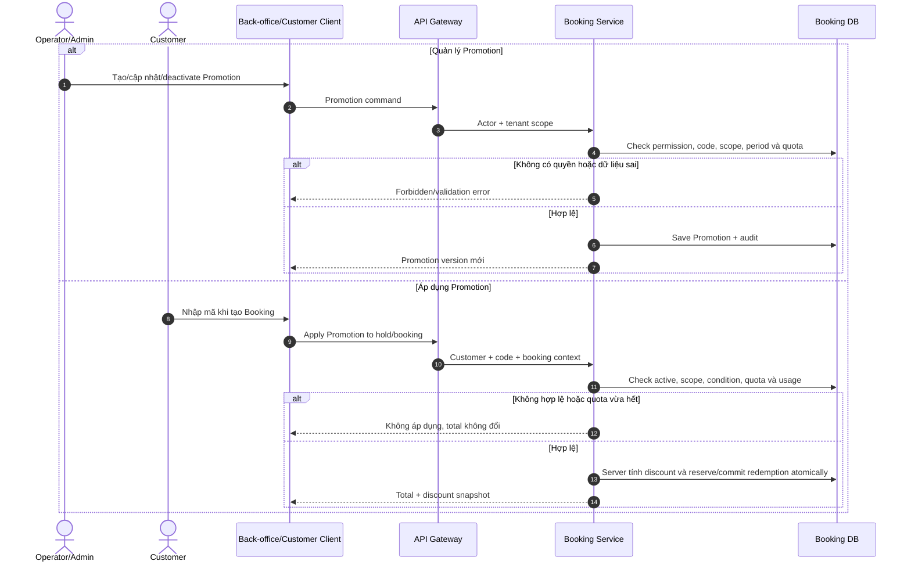
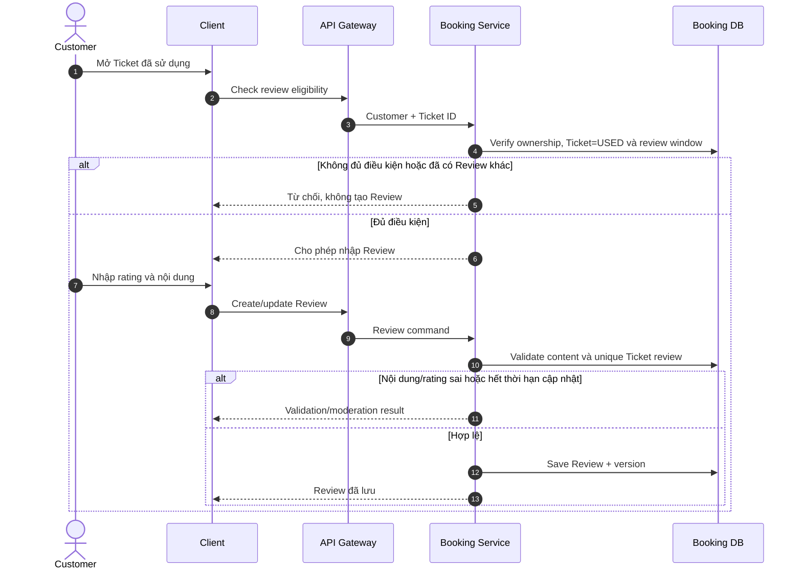
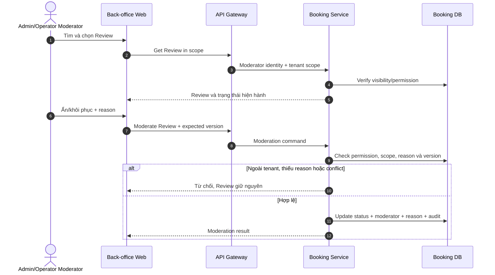
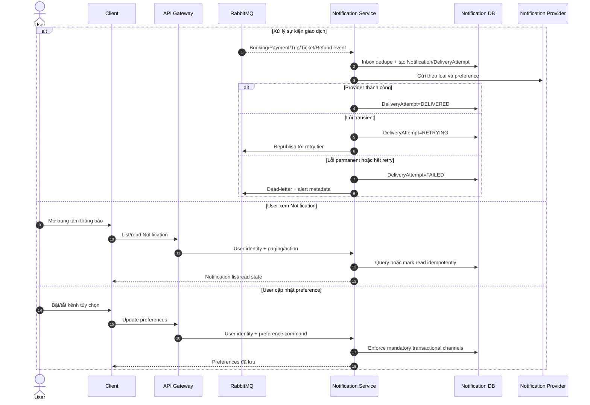

# 2.3.5 Promotion, Review và Notification

Nguồn nghiệp vụ: [SRS — Promotion, Review và Notification](../../srs-v2/04-use-cases/05-promotion-review-notification.md).

## UC-PROMO-01 — Quản lý và áp dụng Promotion

## UC-REVIEW-01 — Tạo và cập nhật Review

## UC-REVIEW-02 — Kiểm duyệt Review

## UC-NOTIF-01 — Xem và cấu hình Notification

Delivery failure không đảo Booking, Payment, Ticket hoặc Refund đã commit.
