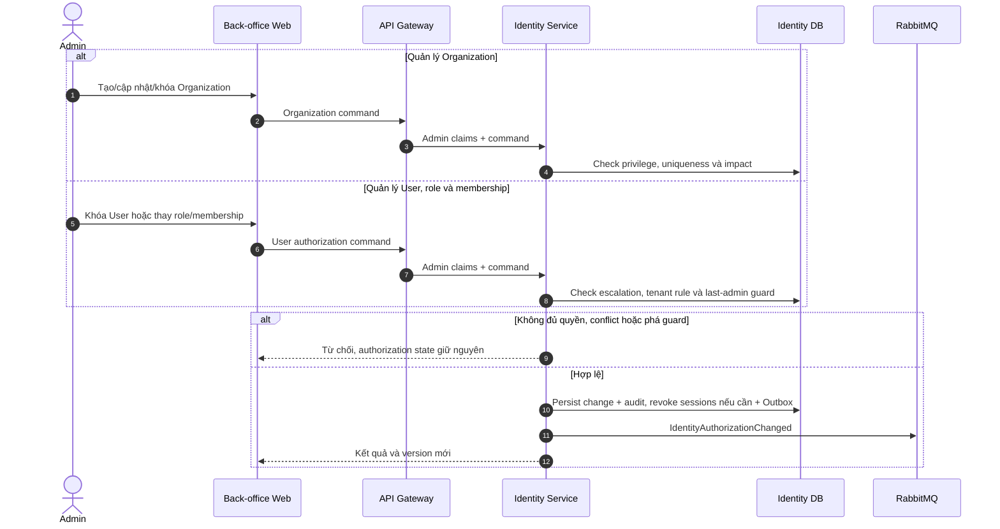
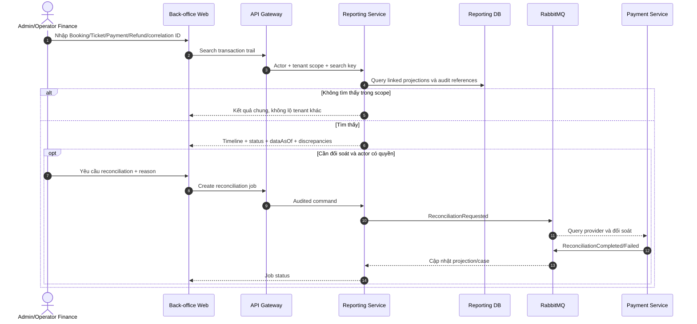
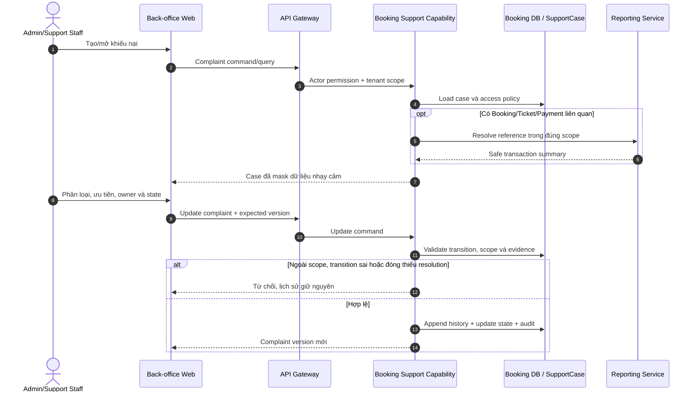
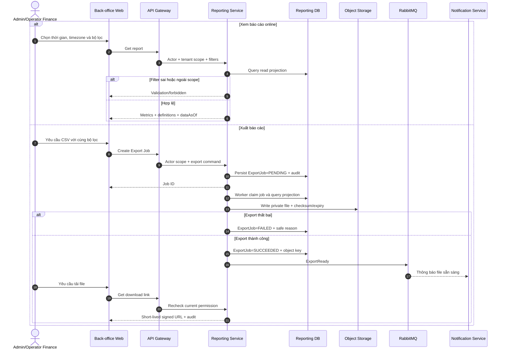

# 2.3.6 Quản trị và báo cáo

Nguồn nghiệp vụ: [SRS — Quản trị và báo cáo](../../srs-v2/04-use-cases/06-administration-reporting.md).

## UC-ADMIN-01 — Quản lý User, Organization và quyền

## UC-ADMIN-02 — Tra cứu giao dịch và audit

## UC-ADMIN-03 — Quản lý khiếu nại

Theo `ADR-014`, Booking Service là owner baseline của SupportCase liên quan giao dịch; nếu capability hỗ trợ phát triển độc lập sẽ có ADR migration/tách service riêng.

## UC-REPORT-01 — Xem và xuất báo cáo

