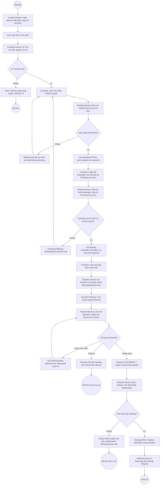

# BP-01 — Tìm chuyến, đặt vé và thanh toán

Nguồn: `BP-01`, `UC-SEARCH-01`, `UC-BOOK-01`, `UC-PAY-01`, `UC-TICKET-01`, `BR-SEAT-*`, `BR-BOOK-*`, `BR-PAY-*`.

## Điểm kiểm soát

- Giữ nhiều ghế là all-or-nothing và được bảo vệ bởi transaction/lock của Booking DB.
- Client không được tin payment redirect hoặc query parameter.
- Duplicate HTTP command, webhook và RabbitMQ delivery không tạo thêm Booking, Payment hoặc Ticket.
- Notification lỗi không rollback Booking đã `PAID`.

