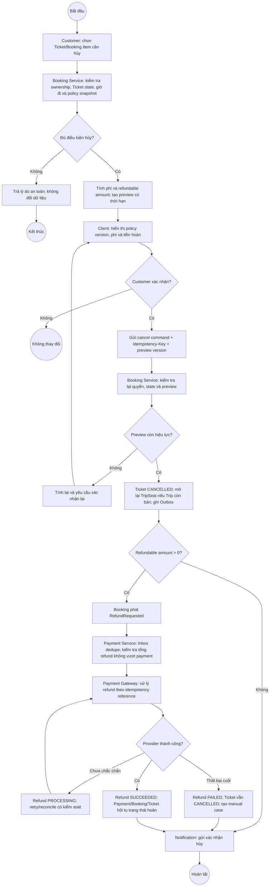

# BP-02 — Hủy vé và hoàn tiền

Nguồn: `BP-02`, `UC-CANCEL-01`, `BR-CANCEL-*`, `BR-PAY-007..010`.

## Điểm kiểm soát

- Preview không thay đổi trạng thái và phải được kiểm tra lại khi xác nhận.
- Refund thất bại không khôi phục quyền sử dụng Ticket.
- Tổng Refund thành công không vượt Payment đã thành công.

