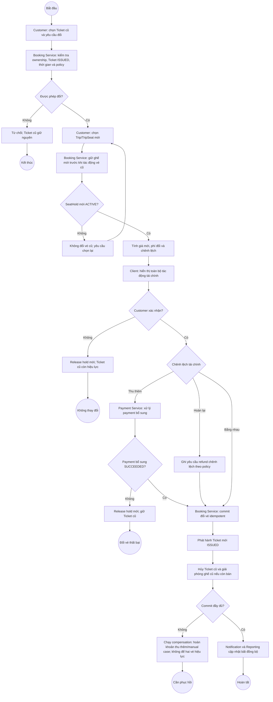

# BP-03 — Đổi vé

Nguồn: `BP-03`, `UC-CHANGE-01` (`SHOULD`), `BR-CANCEL-001..002`, `BR-CANCEL-005..007`, `BR-PAY-*`.

## Điểm kiểm soát

- Ghế mới luôn được giữ trước; Ticket cũ chỉ bị hủy tại điểm commit.
- Command lặp trả logical change hiện có, không tạo thêm Ticket/Payment/Refund.
- Nếu thu thêm tiền nhưng không phát hành được vé mới, phải compensation hoặc mở manual case.

