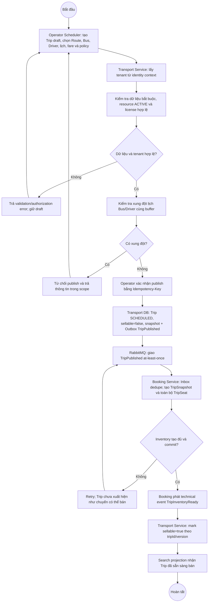

# BP-04 — Tạo và mở bán chuyến xe

Nguồn: `BP-04`, `UC-OPS-05`, `BR-TRIP-001..002`, `BR-SEAT-010`, `BR-TENANT-*`.

## Điểm kiểm soát

- `SCHEDULED` là trạng thái nghiệp vụ; `sellable=false/true` là cờ readiness, không phải state mới.
- Trip chưa được search như có thể bán trước khi Booking DB có đủ `TripSeat`.
- `TripInventoryReady` là technical integration event của thiết kế, dùng để đóng khoảng nhất quán giữa hai service.

