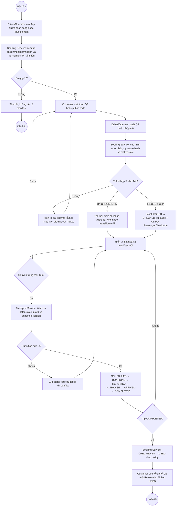

# BP-05 — Vận hành chuyến và check-in

Nguồn: `BP-05`, `UC-OPS-06`, `UC-DRIVER-01`, `UC-REVIEW-01`, `AUTHZ-005..007`.

## Điểm kiểm soát

- Check-in là idempotent và luôn kiểm tra đúng Trip ở server.
- QR offline không được tự bỏ qua xác minh server nếu chưa có offline policy riêng.
- Transition Trip sai thứ tự hoặc sai version bị từ chối.

