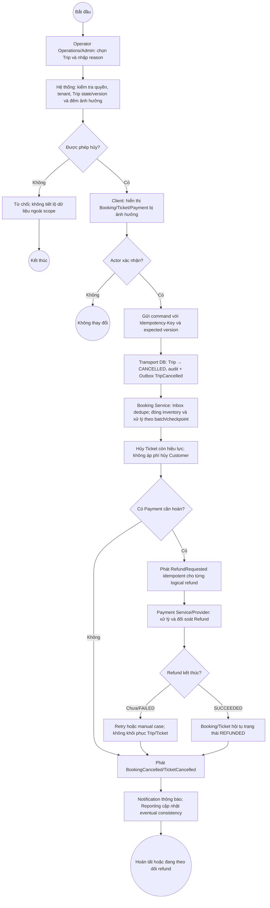

# BP-06 — Hủy chuyến xe có vé đã bán

Nguồn: `BP-06`, `UC-TRIP-01`, `BR-TRIP-004..006`, `BR-CANCEL-008`, `BR-PAY-007..008`.

## Điểm kiểm soát

- Hủy sau `DEPARTED` không đi qua luồng thông thường.
- Batch có checkpoint để tiếp tục sau sự cố; mỗi Booking/Refund có idempotency riêng.
- Refund/Notification lỗi không làm Trip quay lại trạng thái trước.

