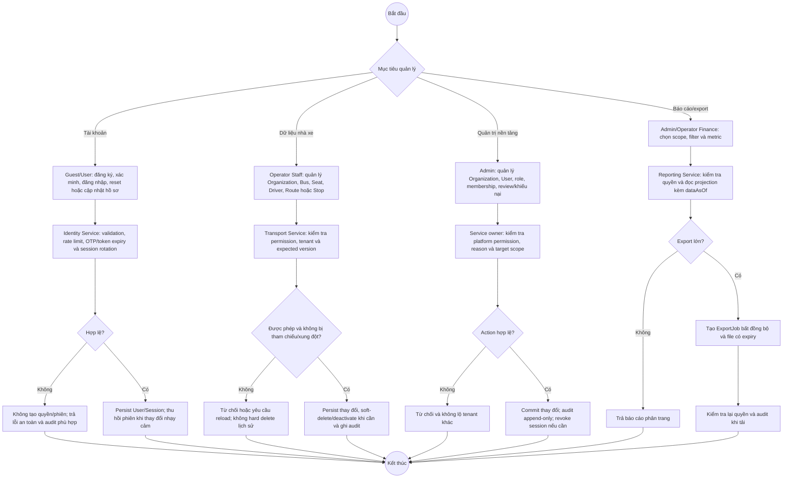

# BP-07 — Quản lý tài khoản, nhà xe và nền tảng

Nguồn: `BP-07`, nhóm `UC-AUTH-*`, `UC-PROFILE-01`, `UC-OPS-01..04`, `UC-PROMO-01`, `UC-REVIEW-02`, `UC-NOTIF-01`, `UC-ADMIN-*`, `UC-REPORT-01`.

BP-07 gồm các luồng quản lý độc lập, vì vậy decision đầu tiên chọn mục tiêu thay vì ngụ ý chúng diễn ra tuần tự.

## Điểm kiểm soát

- Tenant lấy từ identity context, không lấy body/query làm nguồn quyền.
- Entity đã được tham chiếu dùng deactivate/soft delete thay vì hard delete.
- Reporting projection công bố `dataAsOf`; export chứa PII có expiry và audit download.

