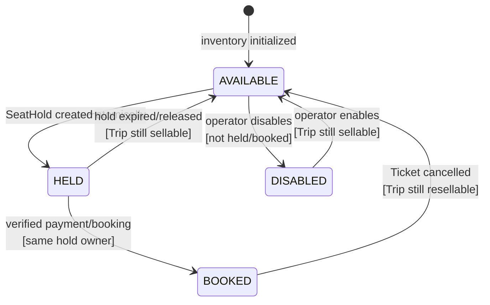

# TripSeat State Machine

Nguồn: SRS `6.1`, `BR-SEAT-*`. Owner: Booking Service.

## Invariant

- `SELECTED` chỉ tồn tại ở UI, không phải state phía server.
- Một `TripSeat` không đồng thời thuộc hai `SeatHold ACTIVE` hoặc hai Ticket còn hiệu lực.
- `BOOKED` không tự về `AVAILABLE` khi TTL/cache hết hạn.
- Giữ nhiều ghế phải thành công toàn bộ hoặc rollback toàn bộ.

