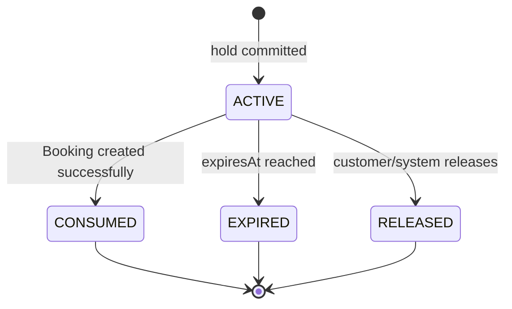

# SeatHold State Machine

Nguồn: SRS `6.2`, `BR-SEAT-*`, `BR-BOOK-*`. Owner: Booking Service.

## Invariant

- `ACTIVE` chỉ được consume một lần.
- `EXPIRED` và `RELEASED` giải phóng đúng các `TripSeat` còn thuộc hold đó.
- Expiry worker kiểm tra database state/version; tín hiệu Redis không phải nguồn sự thật.
- Release lặp trả kết quả idempotent.

