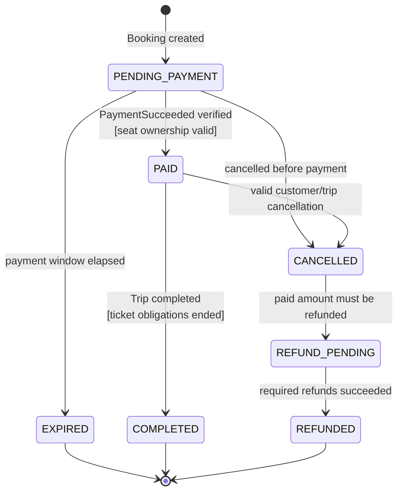

# Booking State Machine

Nguồn: SRS `6.3`, `BR-BOOK-*`, `BR-PAY-*`. Owner: Booking Service.

## Invariant

- `PAID` không cho sửa trực tiếp Passenger hoặc TripSeat.
- Hủy từng Booking Item/Ticket được theo dõi ở mức item; Booking là trạng thái tổng hợp.
- Duplicate `PaymentSucceeded` không tạo lại transition, Ticket hoặc outbox event.
- `CANCELLED` có thể là điểm dừng khi không có khoản phải hoàn; nếu có tiền cần hoàn thì bắt buộc đi qua `REFUND_PENDING`.

