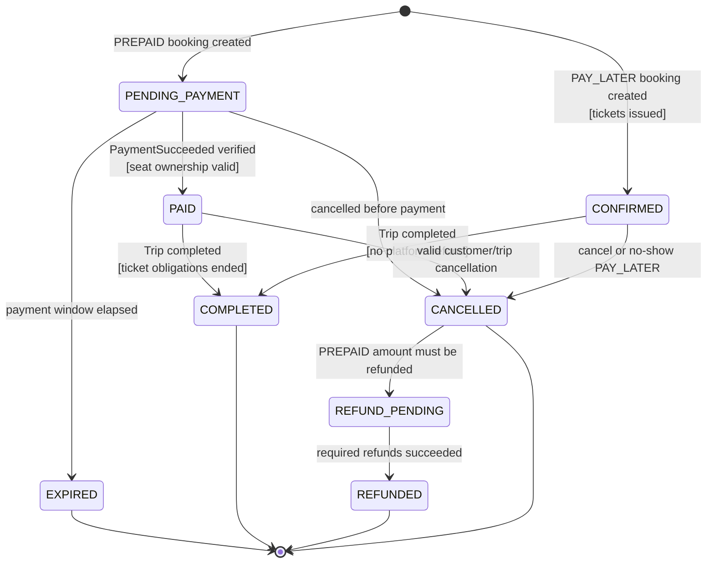

# Booking State Machine

Nguồn: SRS `6.3`, `BR-BOOK-*`, `BR-PAY-*`. Owner: Booking Service.

## Invariant

- `PAID`/`CONFIRMED` không cho sửa trực tiếp Passenger hoặc TripSeat.
- Duplicate `PaymentSucceeded` không tạo lại transition, Ticket hoặc outbox event.
- `CANCELLED` `PREPAID` có tiền cần hoàn thì bắt buộc `REFUND_PENDING`. `PAY_LATER` dừng ở `CANCELLED`.

