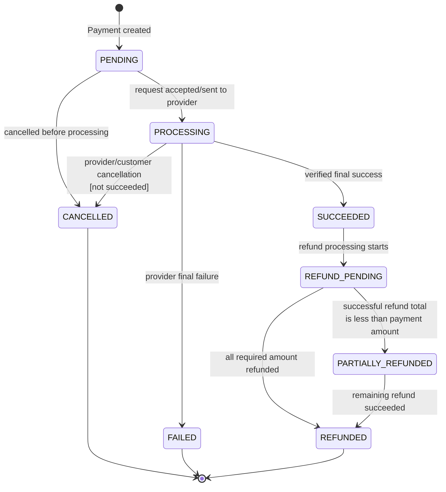

# Payment State Machine

Nguồn: SRS `6.4`, `BR-PAY-*`. Owner: Payment Service.

## Invariant

- Timeout/redirect không phải final failure; trạng thái chưa chắc chắn giữ `PROCESSING`.
- `SUCCEEDED` không đổi thành `FAILED` do callback đến trễ hoặc mâu thuẫn; mở reconciliation case.
- `(provider, externalEventId)` và `(provider, providerTransactionId)` được deduplicate.
- Tổng Refund thành công không vượt amount của Payment.

