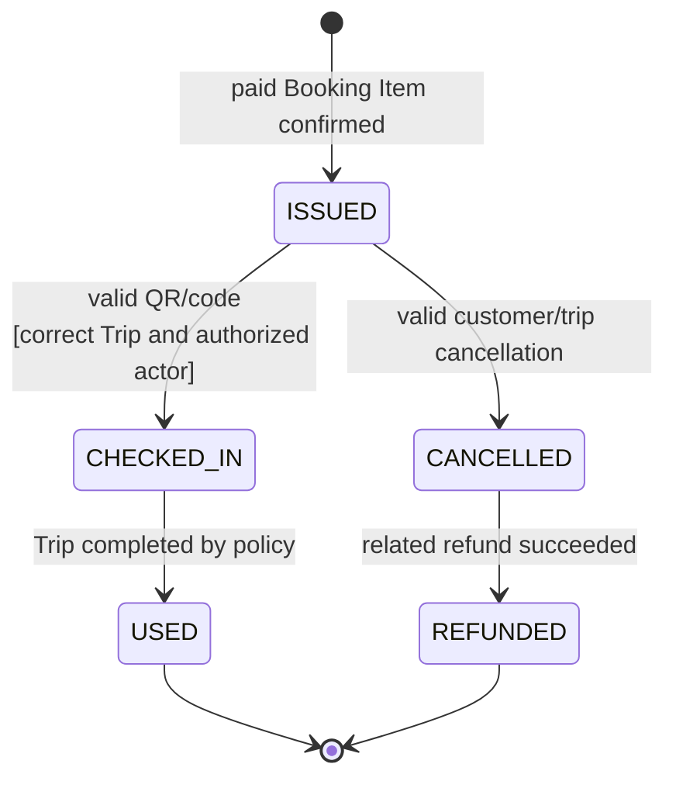

# Ticket State Machine

Nguồn: SRS `6.5`, `BR-TICKET-*`. Owner: Booking Service.

## Invariant

- `CHECKED_IN` và `USED` không được Customer hủy bằng luồng thông thường.
- Check-in lặp trả kết quả/thời điểm cũ, không tạo transition thứ hai.
- `CANCELLED` có thể là điểm dừng nếu không có khoản phải hoàn.
- QR của `CANCELLED`, `REFUNDED` hoặc `USED` không còn được trình bày như vé hiệu lực.

