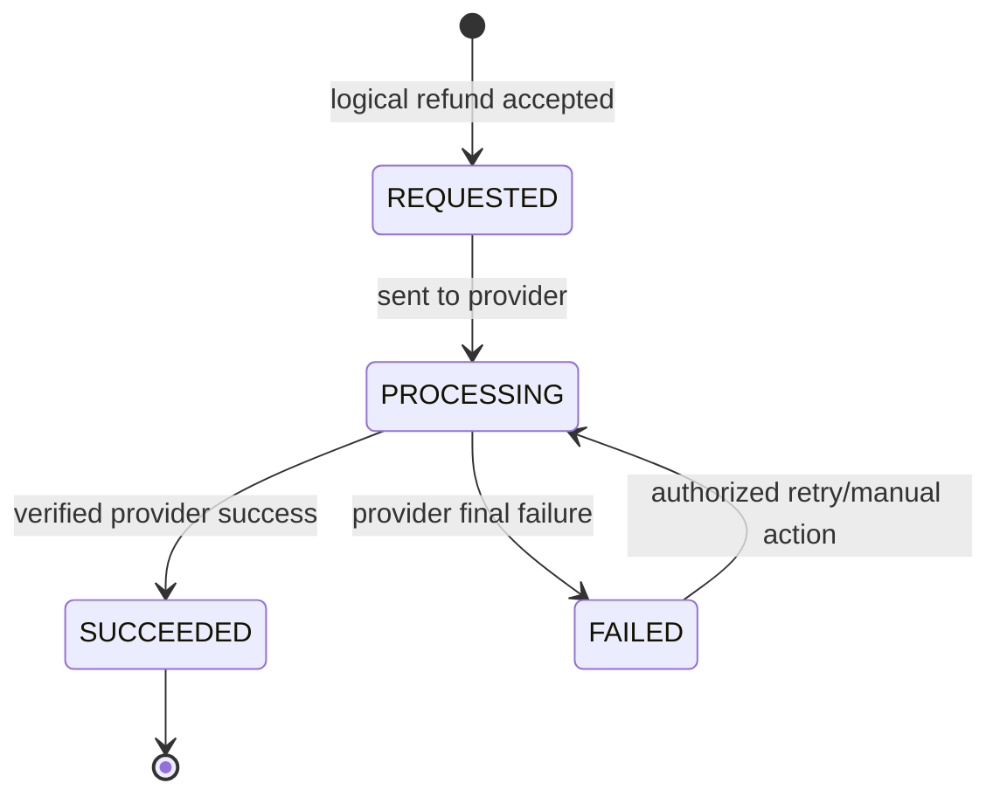

# Refund State Machine

Nguồn: SRS `6.6`, `BR-PAY-007..010`. Owner: Payment Service.

## Invariant

- Retry dùng cùng logical Refund và idempotency reference, không tạo Refund thứ hai.
- `FAILED` không tự khôi phục Ticket hoặc Trip.
- Mỗi lần retry/manual action có audit; lỗi chưa chắc chắn phải reconcile trước khi charge/refund lại.
- Tổng Refund `SUCCEEDED` trên cùng Payment không vượt số tiền Payment thành công.

