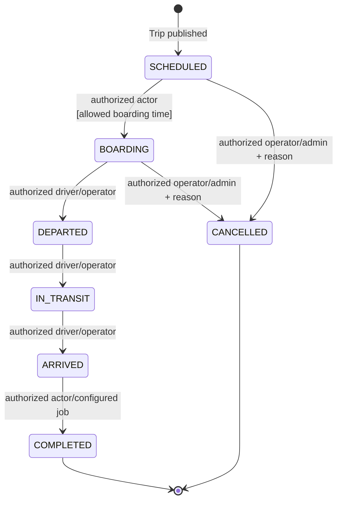

# Trip State Machine

Nguồn: SRS `6.7`, `BR-TRIP-*`. Owner: Transport Service.

## Invariant

- Hủy sau `DEPARTED` không thuộc transition thông thường nếu chưa có policy/quyền đặc biệt được phê duyệt.
- `sellable` là readiness flag phối hợp với inventory Booking, không phải Trip state.
- Mọi transition dùng expected version; xung đột phải reload thay vì ghi đè.
- `TripCancelled` được ghi vào outbox cùng transaction với state và audit.

