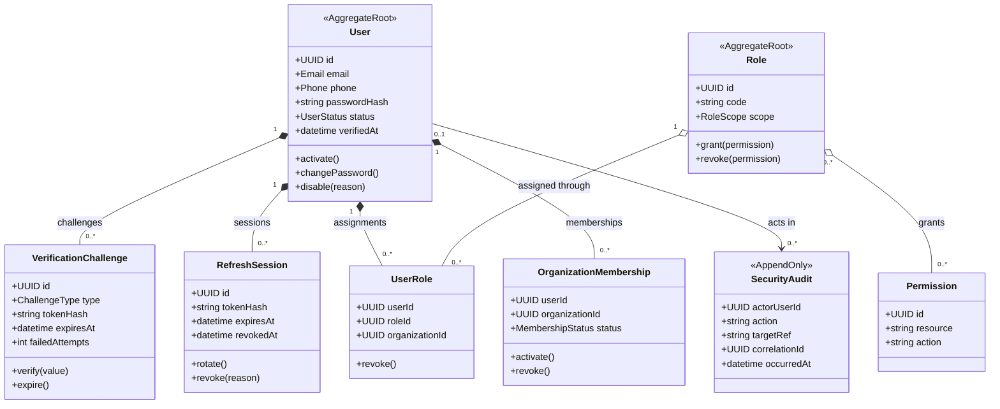

# Identity Domain/Class Diagram

Owner: Identity Service. `organizationId` trong Membership/UserRole là external reference đến Organization do Transport Service sở hữu.

## Boundary rules

- Credential/token chỉ lưu dạng hash khi có thể; challenge có expiry và giới hạn thử.
- Role tenant yêu cầu `organizationId`; Role platform không được vô tình giới hạn bởi body/query tenant.
- Vô hiệu User hoặc thay đổi quyền nhạy cảm phải thu hồi session phù hợp và ghi audit.
