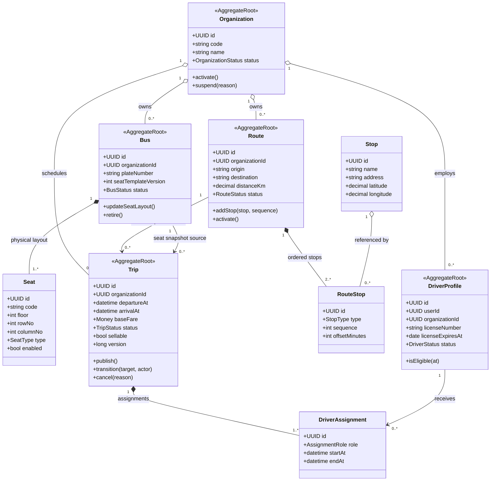

# Transport Domain/Class Diagram

Owner: Transport Service. Đây là nguồn sự thật cho tenant vận tải, tài sản, tuyến và lịch chuyến.

## Aggregate rules

- `Trip.publish()` kiểm tra tenant, Route/Bus/Driver active, license và lịch xung đột trước khi commit.
- Trip event mang snapshot cần thiết; Booking không gọi lại Transport để sửa lịch sử booking.
- Bus/Seat đã được Trip tham chiếu không hard delete; thay đổi layout tăng version cho các Trip tương lai.

