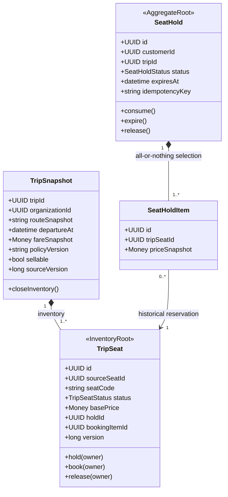
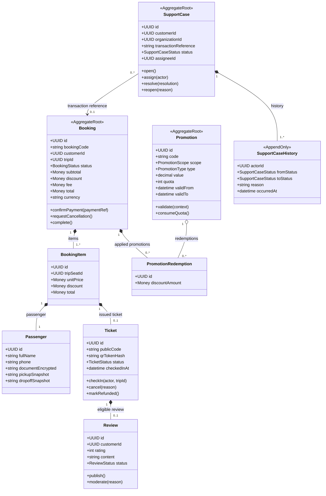

# Booking Domain/Class Diagram

Owner: Booking Service. `customerId` và `sourceTripId/sourceSeatId` là external reference; `TripSnapshot` là bản sao lịch sử cục bộ.

## Inventory và SeatHold

## Booking, Ticket, Promotion và Review

## Aggregate rules

- `TripSeat` concurrency guard là nguồn quyết định chống bán trùng; Redis không thay invariant DB.
- Booking `PAID` có đúng một Ticket trên mỗi Booking Item và dữ liệu item không sửa trực tiếp.
- Review tối đa một bản ghi trên Ticket đủ điều kiện; Promotion redemption không được ghi trùng.
