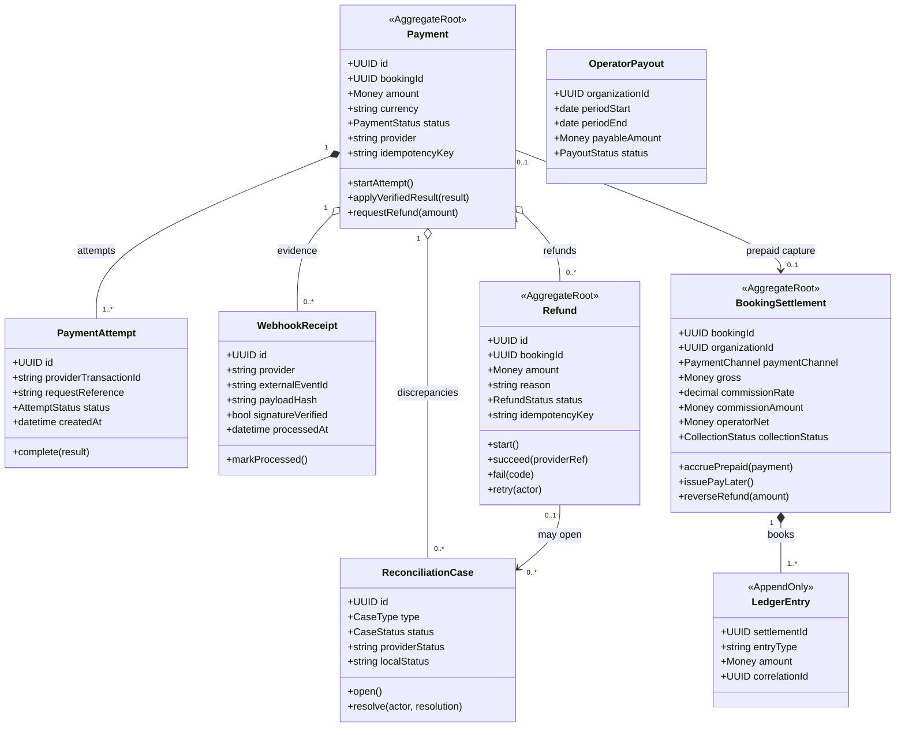

# Payment Domain/Class Diagram

Owner: Payment Service. `bookingId` là external reference, không phải quan hệ đến Booking DB.

## Aggregate rules

- Provider event/transaction ID là unique trong phạm vi provider.
- Payment result và outbox được commit cùng local transaction.
- Refund dùng logical ID/idempotency ổn định qua retry; tổng refund thành công không vượt Payment amount.
- Provider outcome mâu thuẫn không ghi đè `SUCCEEDED`; tạo `ReconciliationCase` có audit.
- Phí sàn snapshot trên Organization, mặc định 10%, chỉ khi `PREPAID` `SUCCEEDED`. `PAY_LATER`: commission = 0, không Payment cổng.
- Ledger append-only; hoàn `PREPAID` đảo commission và operator payable.

