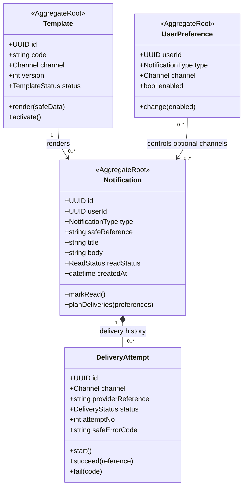

# Notification Domain/Class Diagram

Owner: Notification Service. Delivery lifecycle độc lập với transaction Booking/Payment.

## Aggregate rules

- Thông báo thiết yếu không bị tắt ngoài policy.
- Push/email body không chứa secret, full token hoặc PII không cần thiết.
- Provider lỗi tạo retry có giới hạn; không rollback transaction nguồn.
- Mỗi delivery attempt giữ safe error code và provider reference để vận hành.

