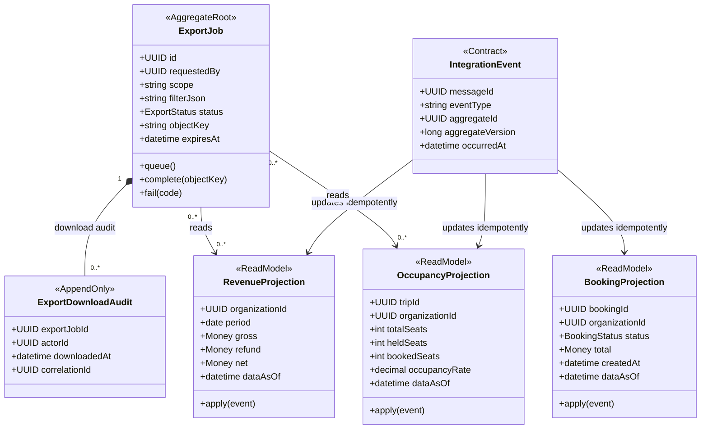

# Reporting Domain/Class Diagram

Owner: Reporting Service. Tất cả projection đều có thể rebuild từ event/reconciliation API và không sửa transaction nguồn.

## Aggregate rules

- API luôn trả `generatedAt/dataAsOf`; eventual-consistency lag phải quan sát được.
- Consumer inbox ngăn một event cộng doanh thu hoặc occupancy hai lần.
- Export lớn chạy bất đồng bộ, lưu object key thay vì payload trong RabbitMQ.
- Quyền được kiểm tra lúc tạo job và kiểm tra lại lúc tải; file có expiry.
