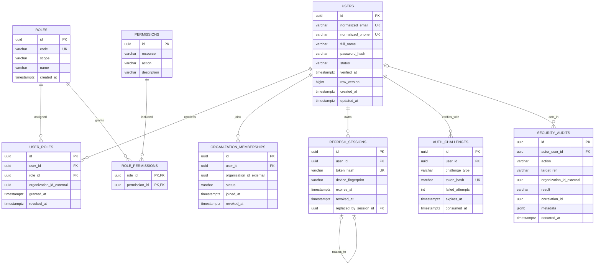

# Identity Database ERD

Database: `identity_db`. `organization_id_external` tham chiếu định danh do Transport Service sở hữu nhưng không có foreign key.

## Constraints và index bắt buộc

- Partial unique trên `normalized_email` và `normalized_phone` khi khác null.
- `UNIQUE(user_id, role_id, organization_id_external)` cho assignment còn hiệu lực; role tenant bắt buộc organization, role platform bắt buộc null theo check constraint.
- `UNIQUE(user_id, organization_id_external)` theo membership policy.
- Token/challenge chỉ lưu hash; index expiry phục vụ cleanup, không dùng token rõ làm lookup/log.
- `security_audits` append-only đối với application role thông thường.

