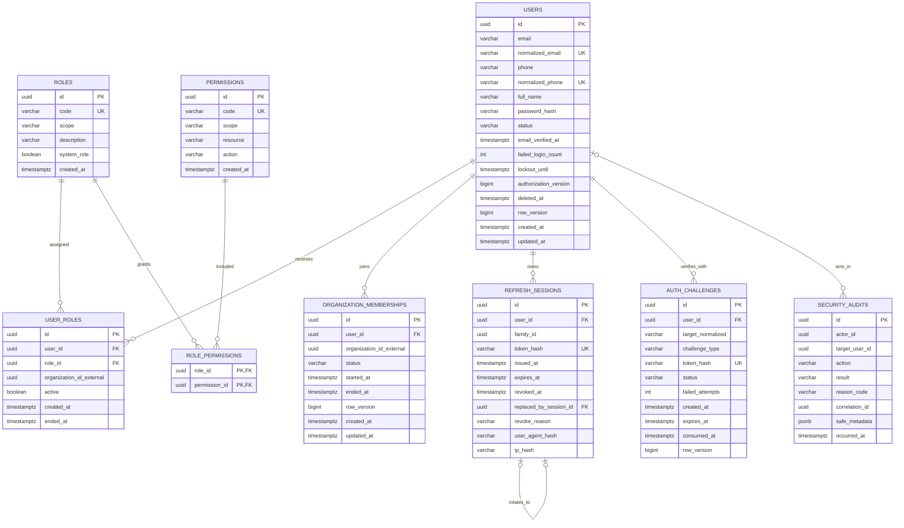

# Identity Database ERD

Database: `identity_db`. Cột trên hình khớp migration [`docs/database/identity/001_initial.sql`](../../database/identity/001_initial.sql). `organization_id_external` tham chiếu định danh do Transport Service sở hữu nhưng không có foreign key.

`roles` không có cột `name`. Nhãn đọc được của role là `description`; định danh máy dùng là `code`.

## Constraints và index bắt buộc

- Partial unique trên `normalized_email` và `normalized_phone` khi `deleted_at is null`.
- `roles.scope` chỉ `PLATFORM`, `TENANT`, `OWN`. Role không có `name`.
- `permissions.code` unique; thêm unique `(scope, resource, action)`. `permissions.scope` chỉ `PLATFORM`, `TENANT`, `REPORT`.
- Role platform/OWN: partial unique `(user_id, role_id)` khi `active` và `organization_id_external is null`. Role tenant: partial unique `(user_id, role_id, organization_id_external)` khi `active` và org khác null.
- Membership: partial unique `(user_id, organization_id_external)` khi status `ACTIVE` hoặc `SUSPENDED`.
- Token/challenge chỉ lưu hash; index expiry phục vụ cleanup, không dùng token rõ làm lookup/log.
- `security_audits` append-only đối với application role thông thường; `actor_id` / `target_user_id` không có FK.
