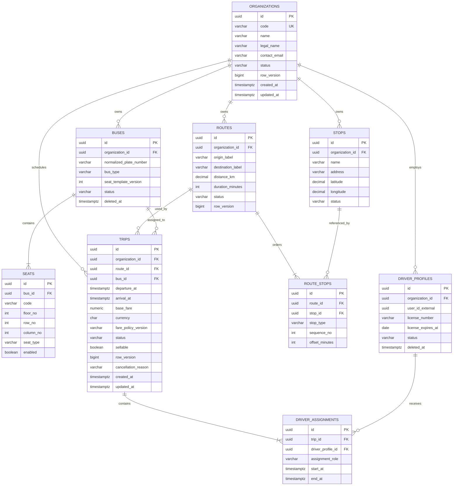

# Transport Database ERD

Database: `transport_db`. `user_id_external` là ID từ Identity Service, không có foreign key.

## Constraints và index bắt buộc

- `UNIQUE(organization_id, normalized_plate_number)` trên Bus hoạt động; `UNIQUE(bus_id, code)` trên Seat.
- `UNIQUE(route_id, stop_type, sequence_no)`; Route có origin/destination hợp lệ và ít nhất hai stop theo policy.
- `arrival_at > departure_at`, fare không âm và currency hợp lệ.
- Exclusion/transaction check ngăn lịch Bus và Driver chồng lấn theo buffer cấu hình.
- Index search Trip bắt đầu từ route/điểm/ngày/status/sellable; tenant index luôn dẫn bằng `organization_id` cho back-office.
