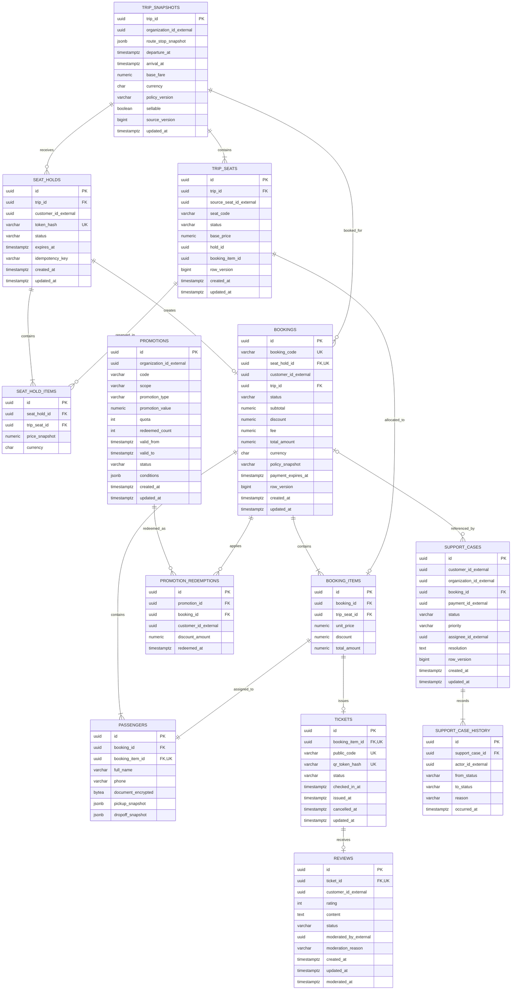

# Booking Database ERD

Database: `booking_db`. `customer_id_external`, `source_trip_id` và `source_seat_id` không có foreign key sang service khác.

## Constraints và index bắt buộc

- `UNIQUE(trip_id, source_seat_id_external)` và `UNIQUE(trip_id, seat_code)` cho TripSeat.
- Partial unique/locking bảo đảm tối đa một hold ACTIVE hoặc một Ticket hiệu lực trên TripSeat; state transition vẫn phải nằm trong transaction.
- `UNIQUE(seat_hold_id, trip_seat_id)` trên item; `BOOKINGS.seat_hold_id` unique bảo đảm một SeatHold chỉ tạo tối đa một Booking.
- Booking Item, Passenger và Ticket có quan hệ 1–1 theo unique constraint; Booking `PAID` phải có đủ Ticket.
- `UNIQUE(scope, organization_id_external, code)` cho Promotion; redemption unique theo Promotion/Booking và quota được cập nhật có concurrency guard.
- Check constraint: rating `1..5`, mọi money không âm và `total_amount = subtotal - discount + fee` theo quy tắc làm tròn đã cấu hình.
- SupportCase đóng bắt buộc `resolution`; state/version guard áp dụng cho assign/transition và history append-only.
