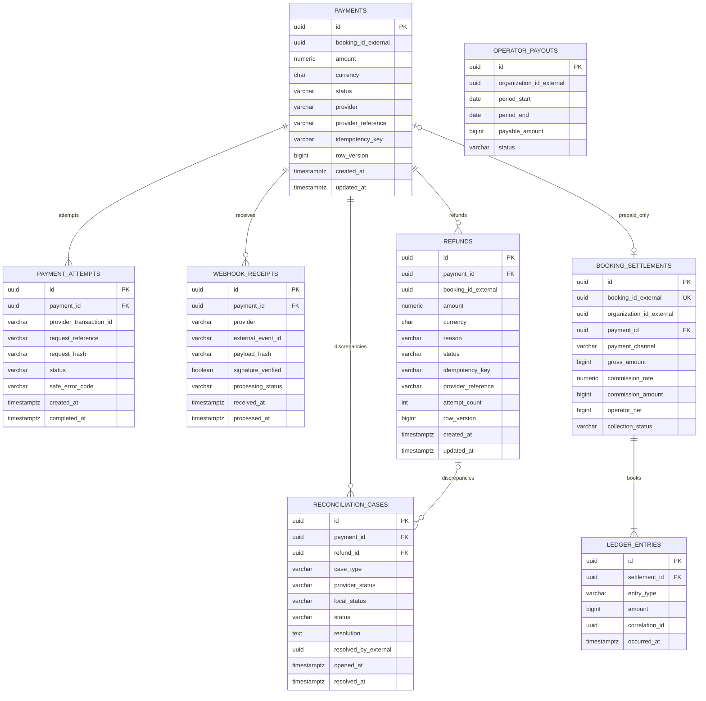

# Payment Database ERD

Database: `payment_db`. `booking_id_external` là external reference đến Booking Service.

## Constraints và index bắt buộc

- `UNIQUE(provider, provider_transaction_id)` trên attempt khi provider ID tồn tại.
- `UNIQUE(provider, external_event_id)` trên webhook receipt; duplicate đã persist trả 2xx và không phát event lần hai.
- `UNIQUE(payment_id, idempotency_key)` trên Refund/Payment command theo logical operation.
- `UNIQUE(booking_id_external)` trên settlement. `PAY_LATER`: `payment_id` null, `commission_amount` = 0. `PREPAID` đã thu: `commission_amount + operator_net = gross`.
- Ledger append-only. Payout ghi kỳ chuyển net cho nhà xe, không FK chéo settlement.
- Không lưu PAN/CVV hoặc raw secret; payload webhook chỉ giữ metadata/payload hash an toàn theo retention.

