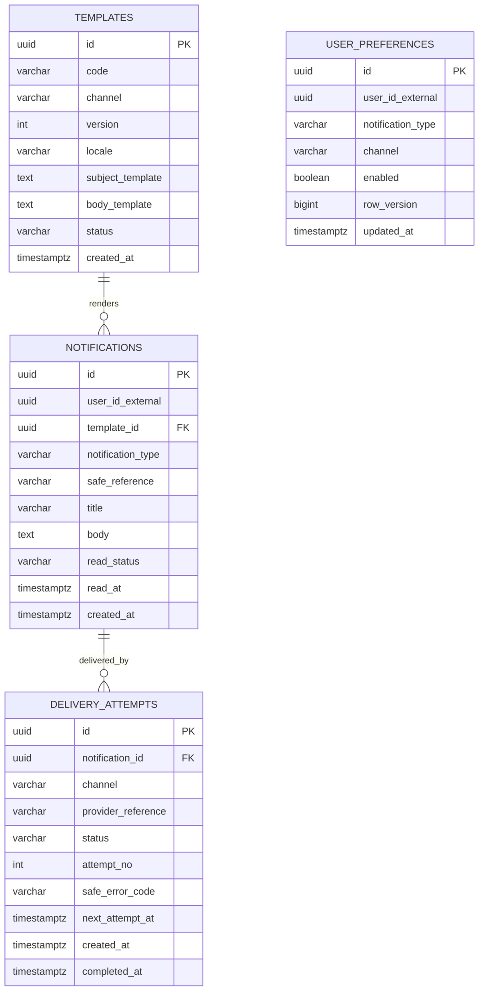

# Notification Database ERD

Database: `notification_db`. User/reference IDs là external reference và không có FK sang service khác.

## Constraints và index bắt buộc

- `UNIQUE(code, channel, locale, version)` trên Template; chỉ một version active theo policy.
- `UNIQUE(user_id_external, notification_type, channel)` trên UserPreference.
- `UNIQUE(notification_id, channel, attempt_no)` trên DeliveryAttempt.
- Index `(user_id_external, created_at desc)` cho inbox người dùng và `(status, next_attempt_at)` cho worker.
- Nội dung/template không được chứa secret, full token hoặc PII không cần thiết.
