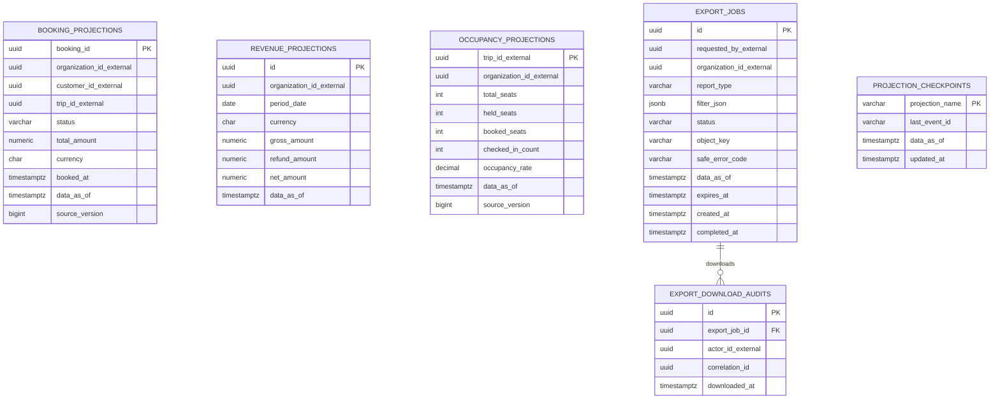

# Reporting Database ERD

Database: `reporting_db`. Các ID nghiệp vụ là projection key, không có FK sang transaction database.

## Constraints và index bắt buộc

- `UNIQUE(organization_id_external, period_date, currency)` trên RevenueProjection.
- Source `aggregateVersion` không được đi lùi; gap được retry hoặc reconcile với owner API.
- API report bắt buộc trả `generatedAt/dataAsOf`; projection không được dùng để update transaction nguồn.
- Export file nằm ở Object Storage; database chỉ giữ object key, expiry và audit metadata.
- `reporting.integration-events.q` vẫn dùng Inbox để dedupe; checkpoint không thay Inbox unique constraint.

