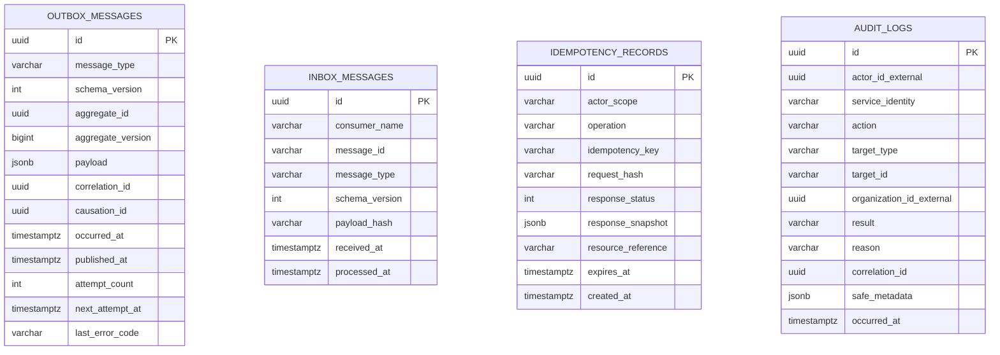

# Inbox, Outbox, Idempotency và Audit ERD

Mẫu này tồn tại trong từng database cần publish/consume message; đây không phải một shared database. Business state và Outbox cùng local transaction; Inbox và consumer side effect cũng cùng local transaction.

## Constraints và lifecycle

- `UNIQUE(consumer_name, message_id)` biến redelivery thành no-op an toàn.
- `UNIQUE(actor_scope, operation, idempotency_key)`; cùng key khác request hash bị từ chối.
- Outbox chỉ set `published_at` sau publisher confirm; timeout giữ row để retry.
- Consumer chỉ ACK sau khi transaction gồm Inbox + side effect + Outbox kế tiếp đã commit.
- Claim Outbox dùng `FOR UPDATE SKIP LOCKED` hoặc cơ chế tương đương; nhiều publisher không được claim cùng row.
- Thao tác nhạy cảm ghi Audit trong transaction hoặc Outbox audit event bền vững; application role thông thường không được update/delete Audit.
- Cleanup theo retention, nhưng không dùng Outbox như event store và không xóa record còn cần đối soát.
