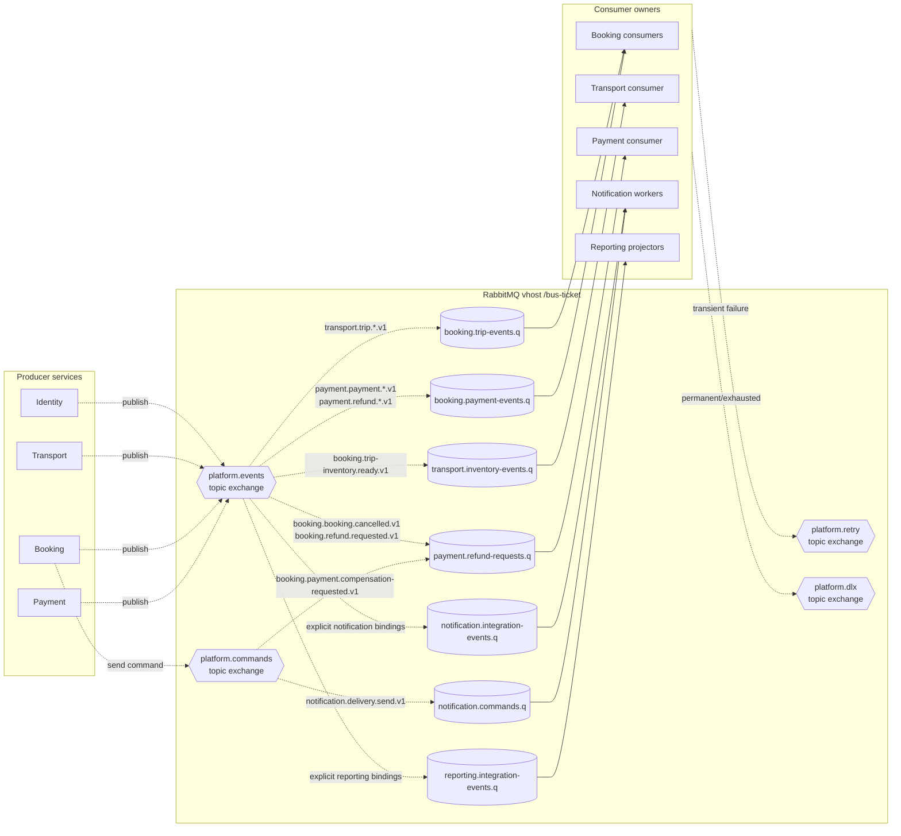

# RabbitMQ Topology

Vhost: `/bus-ticket`. Queue thuộc consumer; mỗi service cần nhận cùng event phải có queue riêng.

## Topology rules

- Tất cả exchange/primary queue bền vững; production ưu tiên quorum queue cho luồng nghiệp vụ quan trọng.
- Reporting không bind `#`; chỉ bind event có projector/schema được triển khai.
- Producer bật mandatory flag; unroutable message không được đánh dấu Outbox thành công.
- Mỗi service có RabbitMQ credential và permission tối thiểu theo exchange/queue của nó.
